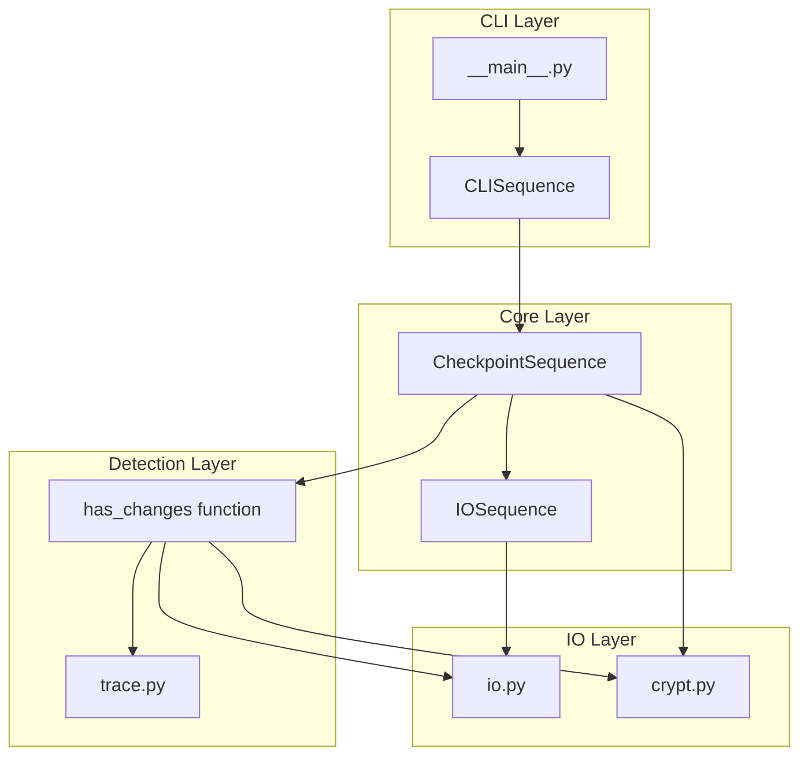
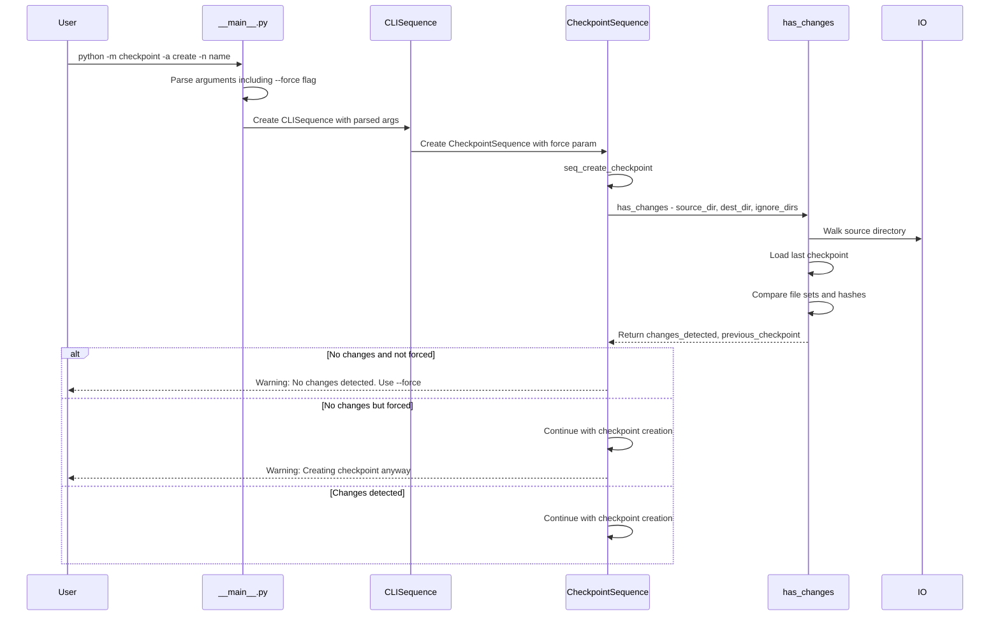

# Change Detection Mechanism Analysis

## Executive Summary

**Important Discovery**: The change detection mechanism with the `--force` flag is **already implemented** in the codebase. The feature requested by the user exists and should be functional.

---

## Current Architecture Overview

### Component Diagram



### Flow Diagram: Checkpoint Creation with Change Detection



---

## Implementation Details

### 1. CLI Argument Parsing - [`checkpoint/__main__.py`](checkpoint/__main__.py)

The `--force` flag is already defined at **lines 168-174**:

```python
checkpoint_arg_parser.add_argument(
    "--force",
    "-f",
    action="store_true",
    default=False,
    help="Force checkpoint creation even if no changes detected."
)
```

### 2. Change Detection Function - [`checkpoint/trace.py`](checkpoint/trace.py:564)

The [`has_changes()`](checkpoint/trace.py:564) function is implemented at **lines 564-675**:

**Function Signature:**
```python
def has_changes(
    source_dir: str,
    dest_dir: str,
    ignore_dirs: List[str],
    current_files: Optional[Dict[str, bytes]] = None
) -> Tuple[bool, Optional[str]]:
```

**Logic Flow:**
1. Check if `.checkpoint` directory exists → If not, return `True, None` (first checkpoint)
2. Check if `.config` file exists → If not, return `True, None`
3. Load checkpoint list from config
4. Get the latest checkpoint
5. Decrypt previous checkpoint files using [`Crypt`](checkpoint/crypt.py)
6. Read current files from source directory
7. Compare file sets (new/deleted files)
8. Compare file contents using SHA-256 hashes
9. Return `(changes_detected, previous_checkpoint_name)`

### 3. CheckpointSequence Integration - [`checkpoint/sequences.py`](checkpoint/sequences.py:553)

The [`CheckpointSequence`](checkpoint/sequences.py:553) class:

**Constructor (lines 556-592):**
- Accepts `force` parameter at line 557 and stores it at line 590

**seq_create_checkpoint method (lines 622-697):**
- Calls [`has_changes()`](checkpoint/sequences.py:636) at lines 636-640
- Handles the result at lines 642-649:

```python
if not changes_detected:
    if not self.force:
        print("[yellow]No changes detected since the last checkpoint. "
              "Use --force to create a checkpoint anyway.[/yellow]")
        return
    else:
        print("[yellow]No changes detected, but --force specified. "
              "Creating checkpoint anyway.[/yellow]")
```

### 4. CLISequence Action Handler - [`checkpoint/sequences.py`](checkpoint/sequences.py:886)

The [`seq_perform_action()`](checkpoint/sequences.py:886) method:

- Extracts `force` flag at **line 899**: `_force = getattr(args, 'force', False)`
- Passes `force` to [`CheckpointSequence`](checkpoint/sequences.py:919) at **line 922**

---

## Data Structures

### Checkpoint Storage Structure

```
destination_dir/
└── .checkpoint/
    ├── .config          # JSON: checkpoint list, settings
    ├── crypt.key        # Encryption key
    ├── checkpoint_name_1/
    │   ├── checkpoint_name_1.json  # Encrypted file contents
    │   ├── .metadata               # File listing
    │   └── trace.json              # Change trace (optional)
    └── checkpoint_name_2/
        └── ...
```

### Config File Structure - `.config`

```json
{
    "current_checkpoint": "checkpoint_name",
    "checkpoints": ["first", "second", ...],
    "ignore_dirs": [".git", "node_modules", ...],
    "source_dir": "/path/to/source",
    "dest_dir": "/path/to/destination",
    "version": "2.0.0"
}
```

---

## Verification Checklist

If the feature is not working as expected, verify:

1. **Version Check**: Ensure you're running the latest code that includes the implementation
2. **Config File**: Verify `.checkpoint/.config` exists and has valid checkpoint list
3. **Encryption Key**: Verify `.checkpoint/crypt.key` exists and is readable
4. **File Permissions**: Ensure the process can read source files and checkpoint files
5. **Ignore Directories**: Check if `.checkpoint` is in ignore_dirs when source == dest

---

## Potential Issues Identified

### Issue 1: Double File Reading

The current implementation reads files twice during checkpoint creation:
1. In [`has_changes()`](checkpoint/trace.py:646) - reads current files for comparison
2. In [`IOSequence.execute_sequence()`](checkpoint/sequences.py:661) - reads files again for encryption

**Impact**: Performance overhead for large codebases

**Recommendation**: Pass `current_files` from `has_changes()` to `IOSequence` to avoid re-reading

### Issue 2: Early Return Without Cleanup

When no changes are detected and `--force` is not used, the method returns early at line 646. This is correct behavior but should ensure proper cleanup if any resources were allocated before the check.

### Issue 3: Error Handling in has_changes

The [`has_changes()`](checkpoint/trace.py:564) function has broad exception handling that returns `True` on any error. While this is safe (creates checkpoint on error), it may mask underlying issues.

---

## Testing Recommendations

To verify the feature works correctly:

```bash
# Test 1: First checkpoint should always succeed
python -m checkpoint -a create -n "first" -s /path/to/source -d /path/to/dest

# Test 2: Second checkpoint without changes should be blocked
python -m checkpoint -a create -n "second" -s /path/to/source -d /path/to/dest
# Expected: Warning message, no checkpoint created

# Test 3: Second checkpoint with --force should succeed
python -m checkpoint -a create -n "second" -s /path/to/source -d /path/to/dest --force
# Expected: Warning message, checkpoint created

# Test 4: After making changes, checkpoint should succeed
# Make a change to source files
python -m checkpoint -a create -n "third" -s /path/to/source -d /path/to/dest
# Expected: Checkpoint created without warning
```

---

## Conclusion

The change detection mechanism with the `--force` flag is **fully implemented** in the codebase. The implementation includes:

| Feature | Status | Location |
|---------|--------|----------|
| `--force` CLI flag | ✅ Implemented | [`__main__.py:168-174`](checkpoint/__main__.py:168) |
| `has_changes()` function | ✅ Implemented | [`trace.py:564-675`](checkpoint/trace.py:564) |
| Integration in CheckpointSequence | ✅ Implemented | [`sequences.py:636-649`](checkpoint/sequences.py:636) |
| Force flag propagation | ✅ Implemented | [`sequences.py:899,922`](checkpoint/sequences.py:899) |
| Warning messages | ✅ Implemented | [`sequences.py:644-649`](checkpoint/sequences.py:644) |

If the feature is not working, the issue may be:
1. Running an older version of the code
2. Corrupted checkpoint configuration
3. File permission issues
4. A bug in the comparison logic

Further investigation would require running the actual commands and observing the behavior.
