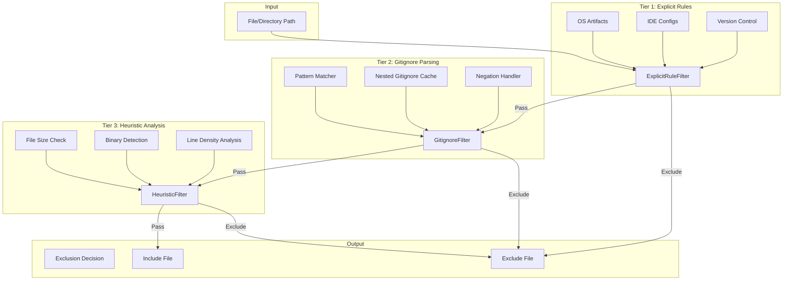
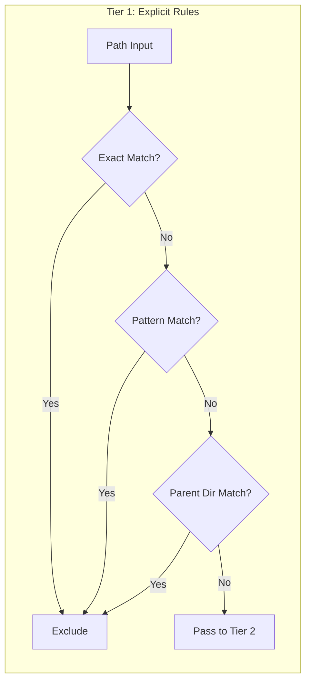
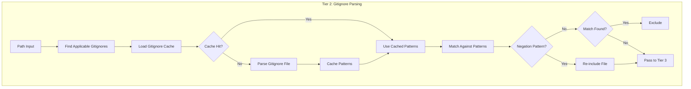
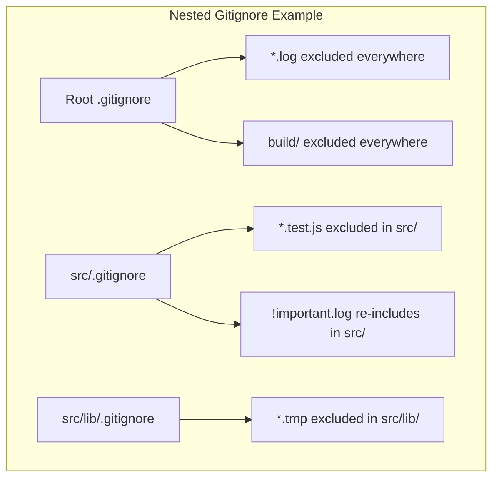
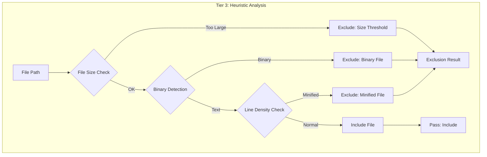
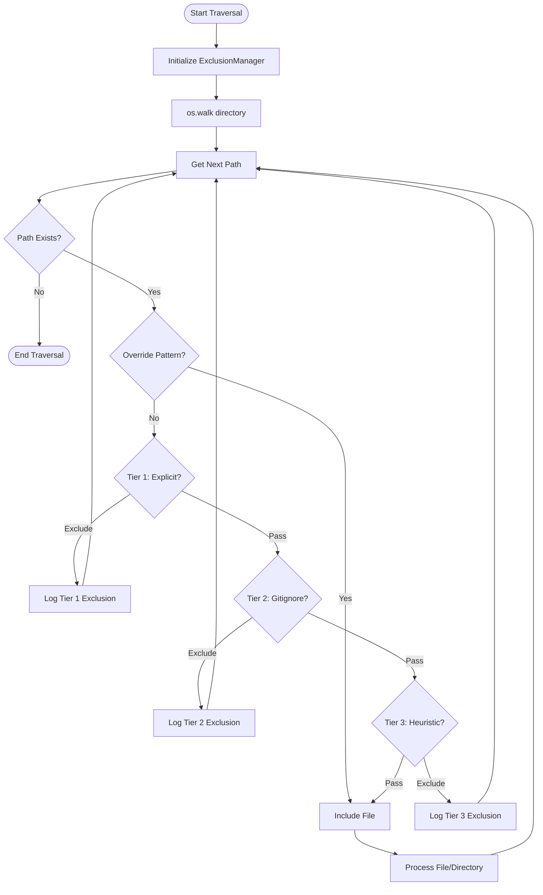

# Three-Tier File/Folder Exclusion System Architecture

## Executive Summary

This document outlines the design for a robust, three-tier file and folder exclusion system for the Checkpoint project. The system provides a hierarchical filtering strategy that balances performance, flexibility, and accuracy when traversing directories recursively.

## Table of Contents

1. [Architecture Overview](#architecture-overview)
2. [Component Design](#component-design)
3. [Tier 1: Explicit Rules](#tier-1-explicit-rules)
4. [Tier 2: Dynamic .gitignore Parsing](#tier-2-dynamic-gitignore-parsing)
5. [Tier 3: Heuristic Analysis](#tier-3-heuristic-analysis)
6. [Data Structures and Interfaces](#data-structures-and-interfaces)
7. [Algorithm Flow](#algorithm-flow)
8. [Integration Points](#integration-points)
9. [Performance Considerations](#performance-considerations)
10. [Edge Cases and Handling](#edge-cases-and-handling)

---

## Architecture Overview

The exclusion system follows a **cascade filtering pattern** where each tier processes files that passed the previous tier. This design ensures fast rejection of common artifacts while providing sophisticated analysis for ambiguous cases.

### Component Diagram



### Design Principles

1. **Fail-Fast**: Common exclusions are handled first with minimal overhead
2. **Separation of Concerns**: Each tier is independently testable and maintainable
3. **Extensibility**: New rules and heuristics can be added without modifying core logic
4. **Performance-Aware**: Expensive operations are deferred to later tiers
5. **Configurability**: Users can override or extend any tier's behavior

---

## Component Design

### ExclusionManager

The central coordinator that orchestrates the three-tier filtering process.

**Responsibilities:**
- Initialize and configure all three tiers
- Execute tiers in priority order
- Cache results for repeated paths
- Provide exclusion reason tracking for debugging

### Filter Interface

All tier filters implement a common interface for consistency:

```python
class ExclusionResult:
    """Result of an exclusion check."""
    excluded: bool
    reason: Optional[str]
    tier: Optional[int]
    metadata: Dict[str, Any]

class IExclusionFilter(Protocol):
    """Protocol for exclusion filter implementations."""
    
    def should_exclude(self, path: str, is_directory: bool) -> ExclusionResult:
        """Check if a path should be excluded.
        
        Args:
            path: Absolute or relative path to check
            is_directory: True if path is a directory
            
        Returns:
            ExclusionResult with exclusion decision and metadata
        """
        ...
    
    def reset(self) -> None:
        """Reset any cached state for a new traversal."""
        ...
```

---

## Tier 1: Explicit Rules

### Purpose

Provide fast, deterministic exclusion of well-known OS, IDE, and version control artifacts that should never be included in checkpoints.

### Design



### Rule Categories

#### 1. Version Control Systems

| Pattern | Type | Description |
|---------|------|-------------|
| `.git` | Directory | Git repository metadata |
| `.svn` | Directory | Subversion metadata |
| `.hg` | Directory | Mercurial metadata |
| `.bzr` | Directory | Bazaar metadata |
| `_darcs` | Directory | Darcs metadata |

#### 2. IDE and Editor Configurations

| Pattern | Type | Description |
|---------|------|-------------|
| `.idea` | Directory | JetBrains IDE configs |
| `.vscode` | Directory | VS Code settings |
| `.vs` | Directory | Visual Studio settings |
| `.sublime-project` | File | Sublime Text project |
| `.sublime-workspace` | File | Sublime Text workspace |
| `.eclipse` | Directory | Eclipse settings |
| `.settings` | Directory | Eclipse project settings |
| `*.swp` | File | Vim swap files |
| `*.swo` | File | Vim swap files |
| `*~` | File | Backup files |

#### 3. Operating System Artifacts

| Pattern | Type | Platform | Description |
|---------|------|----------|-------------|
| `.DS_Store` | File | macOS | Desktop Services Store |
| `Thumbs.db` | File | Windows | Thumbnail cache |
| `desktop.ini` | File | Windows | Folder settings |
| `.Spotlight-V100` | Directory | macOS | Spotlight index |
| `.Trashes` | Directory | macOS | Trash folder |
| `ehthumbs.db` | File | Windows | Media Center thumbnail |
| `Desktop.ini` | File | Windows | Folder customization |

#### 4. Python Artifacts

| Pattern | Type | Description |
|---------|------|-------------|
| `__pycache__` | Directory | Python bytecode cache |
| `*.pyc` | File | Compiled Python |
| `*.pyo` | File | Optimized Python bytecode |
| `*.pyd` | File | Python DLL |
| `.Python` | Directory | Python framework |
| `*.egg-info` | Directory | Egg metadata |
| `*.egg` | File/Dir | Python egg |
| `.eggs` | Directory | Egg directory |

#### 5. Node.js Artifacts

| Pattern | Type | Description |
|---------|------|-------------|
| `node_modules` | Directory | Node.js dependencies |
| `package-lock.json` | File | NPM lock file |
| `yarn.lock` | File | Yarn lock file |
| `yarn-error.log` | File | Yarn error log |
| `.npm` | Directory | NPM cache |
| `.yarn` | Directory | Yarn cache |

#### 6. Build and Distribution

| Pattern | Type | Description |
|---------|------|-------------|
| `dist` | Directory | Distribution output |
| `build` | Directory | Build artifacts |
| `target` | Directory | Build target |
| `out` | Directory | Output directory |
| `*.spec` | File | PyInstaller spec |

### Implementation Strategy

```python
class ExplicitRuleFilter:
    """Tier 1: Fast explicit rule matching."""
    
    # Compiled regex patterns for performance
    DIRECTORY_PATTERNS: Set[str] = {
        '.git', '.svn', '.hg', '.bzr', '_darcs',
        '.idea', '.vscode', '.vs', '.settings', '.eclipse',
        '__pycache__', 'node_modules', '.eggs',
        '.Spotlight-V100', '.Trashes',
        'dist', 'build', 'target', 'out',
        # ... more patterns
    }
    
    FILE_PATTERNS: Set[str] = {
        '.DS_Store', 'Thumbs.db', 'desktop.ini', 'Desktop.ini',
        'ehthumbs.db', '.Python',
        # ... more patterns
    }
    
    FILE_GLOBS: List[re.Pattern] = [
        re.compile(r'.*\.pyc$'),
        re.compile(r'.*\.pyo$'),
        re.compile(r'.*\.pyd$'),
        re.compile(r'.*\.swp$'),
        re.compile(r'.*\.swo$'),
        re.compile(r'.*~$'),
        re.compile(r'.*\.egg$'),
        re.compile(r'.*\.egg-info$'),
        re.compile(r'.*\.spec$'),
        # ... more patterns
    ]
    
    def should_exclude(self, path: str, is_directory: bool) -> ExclusionResult:
        name = os.path.basename(path)
        
        # Fast exact match for directories
        if is_directory and name in self.DIRECTORY_PATTERNS:
            return ExclusionResult(
                excluded=True,
                reason=f"Explicit directory rule: {name}",
                tier=1
            )
        
        # Fast exact match for files
        if not is_directory and name in self.FILE_PATTERNS:
            return ExclusionResult(
                excluded=True,
                reason=f"Explicit file rule: {name}",
                tier=1
            )
        
        # Pattern matching for glob-like rules
        if not is_directory:
            for pattern in self.FILE_GLOBS:
                if pattern.match(name):
                    return ExclusionResult(
                        excluded=True,
                        reason=f"Explicit pattern match: {pattern.pattern}",
                        tier=1
                    )
        
        # Check if any parent directory matches
        parts = pathlib.Path(path).parts
        for part in parts[:-1]:  # Exclude the last part (self)
            if part in self.DIRECTORY_PATTERNS:
                return ExclusionResult(
                    excluded=True,
                    reason=f"Parent directory excluded: {part}",
                    tier=1
                )
        
        return ExclusionResult(excluded=False, tier=1)
```

### Configuration

Users can extend or override explicit rules via configuration:

```python
@dataclass
class ExplicitRuleConfig:
    """Configuration for explicit rules."""
    additional_directory_patterns: List[str] = field(default_factory=list)
    additional_file_patterns: List[str] = field(default_factory=list)
    additional_file_globs: List[str] = field(default_factory=list)
    exclude_patterns: List[str] = field(default_factory=list)  # Patterns to NOT exclude
```

---

## Tier 2: Dynamic .gitignore Parsing

### Purpose

Honor project-specific exclusion patterns defined in `.gitignore` files, supporting standard gitignore syntax including nested files, negations, and directory-specific rules.

### Design



### Gitignore Pattern Syntax Support

The implementation must support the full `.gitignore` syntax:

| Pattern | Meaning | Example |
|---------|---------|---------|
| `foo` | Match any file or directory named foo | `foo` matches `foo`, `a/foo`, `foo/a` |
| `foo/` | Match only directories named foo | `foo/` matches `foo/` but not `a/foo` |
| `/foo` | Match foo only at root | `/foo` matches `foo` but not `a/foo` |
| `foo/*` | Match everything inside foo | `foo/*` matches `foo/a`, `foo/b/c` |
| `**/foo` | Match foo in any directory | `**/foo` matches `foo`, `a/foo`, `a/b/foo` |
| `foo/**` | Match everything under foo | `foo/**` matches `foo/a`, `foo/a/b/c` |
| `**/a/**` | Match any a directory anywhere | `**/a/**` matches `a/b`, `x/a/b`, `x/a/b/c` |
| `*.pyc` | Match all .pyc files | `*.pyc` matches `a.pyc`, `a/b.pyc` |
| `!foo` | Negation - do not exclude foo | `!foo` re-includes foo if previously excluded |
| `\!foo` | Literal !foo | `\!foo` matches file named `!foo` |
| `# comment` | Comment line | Ignored |

### Implementation Strategy

```python
class GitignorePattern:
    """Represents a single parsed gitignore pattern."""
    
    def __init__(self, pattern: str, base_path: str):
        self.original = pattern
        self.base_path = base_path
        self.negation = pattern.startswith('!')
        self.directory_only = pattern.endswith('/')
        self.root_only = pattern.startswith('/')
        
        # Clean and prepare pattern
        self.pattern = self._prepare_pattern(pattern)
        self.regex = self._compile_regex(self.pattern)
    
    def _prepare_pattern(self, pattern: str) -> str:
        """Convert gitignore pattern to regex-compatible string."""
        # Handle negation
        if pattern.startswith('!'):
            pattern = pattern[1:]
        
        # Handle root-only patterns
        if pattern.startswith('/'):
            pattern = pattern[1:]
        
        # Handle directory-only patterns
        if pattern.endswith('/'):
            pattern = pattern[:-1]
        
        # Handle glob patterns
        pattern = pattern.replace('**', '<<<DOUBLE_STAR>>>')
        pattern = pattern.replace('*', '<<<SINGLE_STAR>>>')
        pattern = pattern.replace('?', '<<<QUESTION>>>')
        
        # Escape regex special characters
        pattern = re.escape(pattern)
        
        # Convert back glob patterns
        pattern = pattern.replace('<<<DOUBLE_STAR>>>', '.*')
        pattern = pattern.replace('<<<SINGLE_STAR>>>', '[^/]*')
        pattern = pattern.replace('<<<QUESTION>>>', '[^/]')
        
        return pattern
    
    def matches(self, path: str, is_directory: bool) -> bool:
        """Check if this pattern matches the given path."""
        # Directory-only patterns only match directories
        if self.directory_only and not is_directory:
            return False
        
        # Compute relative path from base
        rel_path = os.path.relpath(path, self.base_path)
        
        # Root-only patterns must match from the base
        if self.root_only:
            return bool(self.regex.match(rel_path))
        
        # Non-root patterns can match anywhere
        return bool(self.regex.search(rel_path))


class GitignoreFilter:
    """Tier 2: Dynamic .gitignore parsing and matching."""
    
    def __init__(self, root_path: str):
        self.root_path = root_path
        self._gitignore_cache: Dict[str, List[GitignorePattern]] = {}
        self._gitignore_locations: List[str] = []
        self._discover_gitignores()
    
    def _discover_gitignores(self) -> None:
        """Find all .gitignore files in the project."""
        # Walk the directory tree to find all .gitignore files
        for root, dirs, files in os.walk(self.root_path):
            # Skip excluded directories from Tier 1
            if '.gitignore' in files:
                self._gitignore_locations.append(
                    os.path.join(root, '.gitignore')
                )
    
    def _parse_gitignore(self, gitignore_path: str) -> List[GitignorePattern]:
        """Parse a .gitignore file and return list of patterns."""
        patterns = []
        base_path = os.path.dirname(gitignore_path)
        
        try:
            with open(gitignore_path, 'r', encoding='utf-8') as f:
                for line in f:
                    line = line.strip()
                    
                    # Skip empty lines and comments
                    if not line or line.startswith('#'):
                        continue
                    
                    # Handle escaped comments
                    if line.startswith('\\#'):
                        line = line[1:]
                    
                    patterns.append(GitignorePattern(line, base_path))
        except (IOError, UnicodeDecodeError):
            pass  # Skip unreadable gitignore files
        
        return patterns
    
    def _get_applicable_patterns(self, path: str) -> List[GitignorePattern]:
        """Get all gitignore patterns applicable to a path."""
        applicable = []
        
        for gitignore_path in self._gitignore_locations:
            gitignore_dir = os.path.dirname(gitignore_path)
            
            # Pattern applies if path is under gitignore directory
            if path.startswith(gitignore_dir):
                if gitignore_path not in self._gitignore_cache:
                    self._gitignore_cache[gitignore_path] = self._parse_gitignore(gitignore_path)
                applicable.extend(self._gitignore_cache[gitignore_path])
        
        return applicable
    
    def should_exclude(self, path: str, is_directory: bool) -> ExclusionResult:
        """Check if path should be excluded based on gitignore rules."""
        patterns = self._get_applicable_patterns(path)
        
        # Sort patterns by specificity (more specific patterns last)
        # This ensures negation patterns work correctly
        
        excluded = False
        exclude_reason = None
        
        for pattern in patterns:
            if pattern.matches(path, is_directory):
                if pattern.negation:
                    excluded = False
                    exclude_reason = None
                else:
                    excluded = True
                    exclude_reason = f"Gitignore pattern: {pattern.original}"
        
        if excluded:
            return ExclusionResult(
                excluded=True,
                reason=exclude_reason,
                tier=2,
                metadata={'pattern': exclude_reason}
            )
        
        return ExclusionResult(excluded=False, tier=2)
    
    def reset(self) -> None:
        """Clear cache for new traversal."""
        self._gitignore_cache.clear()
        self._gitignore_locations.clear()
        self._discover_gitignores()
```

### Nested Gitignore Handling

When multiple `.gitignore` files exist in a project, patterns are applied in order of specificity:

1. Root `.gitignore` patterns apply to entire project
2. Subdirectory `.gitignore` patterns apply only to that subdirectory and below
3. Child patterns can override parent patterns via negation



---

## Tier 3: Heuristic Analysis

### Purpose

Apply intelligent analysis to files that pass Tiers 1 and 2, detecting files that should be excluded based on content characteristics rather than explicit rules.

### Design



### Heuristic Components

#### 1. File Size Threshold

Exclude files that exceed a configurable size threshold.

**Rationale:**
- Large files slow down checkpoint operations
- Large files are often generated outputs, datasets, or binaries
- Memory efficiency during processing

**Default Thresholds:**

| File Type | Threshold | Rationale |
|-----------|-----------|-----------|
| All files | 10 MB | General limit |
| Text files | 5 MB | Text files should be smaller |
| JSON/XML | 2 MB | Structured data limit |

**Implementation:**

```python
@dataclass
class SizeThresholdConfig:
    """Configuration for size-based exclusion."""
    default_max_bytes: int = 10 * 1024 * 1024  # 10 MB
    text_max_bytes: int = 5 * 1024 * 1024  # 5 MB
    json_max_bytes: int = 2 * 1024 * 1024  # 2 MB
    enabled: bool = True


class SizeHeuristic:
    """File size-based exclusion heuristic."""
    
    def __init__(self, config: SizeThresholdConfig = None):
        self.config = config or SizeThresholdConfig()
    
    def check(self, path: str, is_directory: bool) -> ExclusionResult:
        if is_directory or not self.config.enabled:
            return ExclusionResult(excluded=False, tier=3)
        
        try:
            size = os.path.getsize(path)
            extension = pathlib.Path(path).suffix.lower()
            
            # Check extension-specific thresholds
            if extension in {'.json', '.xml'}:
                max_size = self.config.json_max_bytes
            elif extension in TEXT_EXTENSIONS:
                max_size = self.config.text_max_bytes
            else:
                max_size = self.config.default_max_bytes
            
            if size > max_size:
                return ExclusionResult(
                    excluded=True,
                    reason=f"File size {size} exceeds threshold {max_size}",
                    tier=3,
                    metadata={'size': size, 'threshold': max_size}
                )
        except OSError:
            pass  # Skip files we can't stat
        
        return ExclusionResult(excluded=False, tier=3)
```

#### 2. Binary Detection

Identify and exclude binary files that cannot be meaningfully processed.

**Detection Methods:**

1. **Extension Check**: Known binary extensions
2. **Null Byte Detection**: Presence of null bytes in content
3. **Encoding Detection**: Failure to decode as text
4. **Magic Bytes**: Check file signatures

**Implementation:**

```python
class BinaryHeuristic:
    """Binary file detection heuristic."""
    
    # Known binary file signatures (magic bytes)
    BINARY_SIGNATURES = {
        b'\x89PNG': 'PNG image',
        b'GIF87a': 'GIF image',
        b'GIF89a': 'GIF image',
        b'\xff\xd8\xff': 'JPEG image',
        b'PK\x03\x04': 'ZIP archive',
        b'Rar!': 'RAR archive',
        b'\x1f\x8b': 'GZIP archive',
        b'BZh': 'BZIP2 archive',
        b'\x00\x00\x01\x00': 'ICO image',
        b'MZ': 'Windows executable',
        b'\x7fELF': 'Linux executable',
        b'%PDF': 'PDF document',
        b'SQLite': 'SQLite database',
    }
    
    # Sample size for binary detection
    SAMPLE_SIZE = 8192
    
    def check(self, path: str, is_directory: bool) -> ExclusionResult:
        if is_directory:
            return ExclusionResult(excluded=False, tier=3)
        
        try:
            with open(path, 'rb') as f:
                sample = f.read(self.SAMPLE_SIZE)
            
            # Check for magic bytes
            for signature, file_type in self.BINARY_SIGNATURES.items():
                if sample.startswith(signature):
                    return ExclusionResult(
                        excluded=True,
                        reason=f"Binary file detected: {file_type}",
                        tier=3,
                        metadata={'type': file_type, 'method': 'magic_bytes'}
                    )
            
            # Check for null bytes (strong indicator of binary)
            if b'\x00' in sample:
                return ExclusionResult(
                    excluded=True,
                    reason="Binary file detected: null bytes found",
                    tier=3,
                    metadata={'method': 'null_bytes'}
                )
            
            # Try to decode as text
            try:
                sample.decode('utf-8')
            except UnicodeDecodeError:
                # Try other common encodings
                for encoding in ['latin-1', 'utf-16', 'utf-16-le', 'utf-16-be']:
                    try:
                        sample.decode(encoding)
                        break
                    except UnicodeDecodeError:
                        continue
                else:
                    return ExclusionResult(
                        excluded=True,
                        reason="Binary file detected: not decodable as text",
                        tier=3,
                        metadata={'method': 'encoding_check'}
                    )
        
        except (IOError, OSError):
            pass  # Skip files we can't read
        
        return ExclusionResult(excluded=False, tier=3)
```

#### 3. Line Density Analysis

Detect and exclude minified or generated files with abnormally high line density.

**Detection Criteria:**

| Metric | Threshold | Rationale |
|--------|-----------|-----------|
| Average line length | > 500 chars | Minified files have very long lines |
| Max line length | > 10000 chars | Generated files may have extreme lines |
| Lines per KB | < 0.5 | Very few lines for file size |
| Non-whitespace ratio | > 0.95 | Minified files have little whitespace |

**Implementation:**

```python
@dataclass
class LineDensityConfig:
    """Configuration for line density analysis."""
    max_avg_line_length: int = 500
    max_line_length: int = 10000
    min_lines_per_kb: float = 0.5
    max_non_whitespace_ratio: float = 0.95
    sample_size: int = 100  # Number of lines to sample
    enabled: bool = True


class LineDensityHeuristic:
    """Line density analysis for minified file detection."""
    
    def __init__(self, config: LineDensityConfig = None):
        self.config = config or LineDensityConfig()
    
    def check(self, path: str, is_directory: bool) -> ExclusionResult:
        if is_directory or not self.config.enabled:
            return ExclusionResult(excluded=False, tier=3)
        
        # Only check text files
        extension = pathlib.Path(path).suffix.lower()
        if extension not in TEXT_EXTENSIONS:
            return ExclusionResult(excluded=False, tier=3)
        
        try:
            with open(path, 'r', encoding='utf-8', errors='ignore') as f:
                lines = []
                total_chars = 0
                max_line_length = 0
                total_whitespace = 0
                
                for i, line in enumerate(f):
                    if i >= self.config.sample_size:
                        break
                    
                    lines.append(line)
                    total_chars += len(line)
                    max_line_length = max(max_line_length, len(line))
                    total_whitespace += sum(1 for c in line if c.isspace())
                
                if not lines:
                    return ExclusionResult(excluded=False, tier=3)
                
                # Calculate metrics
                avg_line_length = total_chars / len(lines)
                non_ws_ratio = 1 - (total_whitespace / total_chars) if total_chars > 0 else 0
                lines_per_kb = len(lines) / (total_chars / 1024) if total_chars > 0 else float('inf')
                
                # Check thresholds
                reasons = []
                
                if avg_line_length > self.config.max_avg_line_length:
                    reasons.append(f"Average line length {avg_line_length:.0f} > {self.config.max_avg_line_length}")
                
                if max_line_length > self.config.max_line_length:
                    reasons.append(f"Max line length {max_line_length} > {self.config.max_line_length}")
                
                if lines_per_kb < self.config.min_lines_per_kb:
                    reasons.append(f"Lines per KB {lines_per_kb:.2f} < {self.config.min_lines_per_kb}")
                
                if non_ws_ratio > self.config.max_non_whitespace_ratio:
                    reasons.append(f"Non-whitespace ratio {non_ws_ratio:.2f} > {self.config.max_non_whitespace_ratio}")
                
                if reasons:
                    return ExclusionResult(
                        excluded=True,
                        reason=f"Minified file detected: {'; '.join(reasons)}",
                        tier=3,
                        metadata={
                            'avg_line_length': avg_line_length,
                            'max_line_length': max_line_length,
                            'lines_per_kb': lines_per_kb,
                            'non_ws_ratio': non_ws_ratio
                        }
                    )
        
        except (IOError, OSError):
            pass  # Skip files we can't read
        
        return ExclusionResult(excluded=False, tier=3)
```

### Composite Heuristic Filter

```python
class HeuristicFilter:
    """Tier 3: Composite heuristic analysis."""
    
    def __init__(
        self,
        size_config: SizeThresholdConfig = None,
        density_config: LineDensityConfig = None
    ):
        self.size_heuristic = SizeHeuristic(size_config)
        self.binary_heuristic = BinaryHeuristic()
        self.density_heuristic = LineDensityHeuristic(density_config)
    
    def should_exclude(self, path: str, is_directory: bool) -> ExclusionResult:
        """Apply all heuristics in order of cost."""
        # Size check is cheapest (just a stat call)
        result = self.size_heuristic.check(path, is_directory)
        if result.excluded:
            return result
        
        # Binary detection requires reading file header
        result = self.binary_heuristic.check(path, is_directory)
        if result.excluded:
            return result
        
        # Line density is most expensive (reads and parses content)
        result = self.density_heuristic.check(path, is_directory)
        if result.excluded:
            return result
        
        return ExclusionResult(excluded=False, tier=3)
    
    def reset(self) -> None:
        """Reset any cached state."""
        pass  # No caching in current implementation
```

---

## Data Structures and Interfaces

### Core Data Structures

```python
from dataclasses import dataclass, field
from typing import Dict, List, Optional, Set, Any, Protocol
from enum import Enum


class ExclusionTier(Enum):
    """Enumeration of exclusion tiers."""
    EXPLICIT = 1
    GITIGNORE = 2
    HEURISTIC = 3


@dataclass
class ExclusionResult:
    """Result of an exclusion check."""
    excluded: bool
    tier: Optional[int] = None
    reason: Optional[str] = None
    metadata: Dict[str, Any] = field(default_factory=dict)


@dataclass
class ExclusionConfig:
    """Configuration for the exclusion system."""
    # Tier 1 configuration
    explicit_rules_enabled: bool = True
    additional_directory_patterns: List[str] = field(default_factory=list)
    additional_file_patterns: List[str] = field(default_factory=list)
    override_patterns: List[str] = field(default_factory=list)  # Never exclude these
    
    # Tier 2 configuration
    gitignore_enabled: bool = True
    gitignore_paths: List[str] = field(default_factory=list)  # Additional gitignore files
    
    # Tier 3 configuration
    heuristics_enabled: bool = True
    max_file_size_bytes: int = 10 * 1024 * 1024
    max_avg_line_length: int = 500
    detect_binary: bool = True
    detect_minified: bool = True


@dataclass
class TraversalContext:
    """Context for a directory traversal operation."""
    root_path: str
    current_path: str
    depth: int
    parent_excluded: bool = False
    exclusion_history: List[ExclusionResult] = field(default_factory=list)
```

### Interface Definitions

```python
class IExclusionFilter(Protocol):
    """Protocol for exclusion filter implementations."""
    
    def should_exclude(self, path: str, is_directory: bool) -> ExclusionResult:
        """Check if a path should be excluded."""
        ...
    
    def reset(self) -> None:
        """Reset cached state for new traversal."""
        ...


class IExclusionManager(Protocol):
    """Protocol for the exclusion manager."""
    
    def configure(self, config: ExclusionConfig) -> None:
        """Configure the exclusion system."""
        ...
    
    def should_exclude(self, path: str, is_directory: bool) -> ExclusionResult:
        """Check if a path should be excluded through all tiers."""
        ...
    
    def get_exclusion_stats(self) -> Dict[str, Any]:
        """Get statistics about exclusions during traversal."""
        ...
    
    def reset(self) -> None:
        """Reset for a new traversal."""
        ...
```

### Complete ExclusionManager Implementation

```python
class ExclusionManager:
    """Central coordinator for the three-tier exclusion system."""
    
    def __init__(self, root_path: str, config: ExclusionConfig = None):
        self.root_path = os.path.abspath(root_path)
        self.config = config or ExclusionConfig()
        
        # Initialize tier filters
        self._explicit_filter = ExplicitRuleFilter(self.config)
        self._gitignore_filter = GitignoreFilter(self.root_path) if self.config.gitignore_enabled else None
        self._heuristic_filter = HeuristicFilter() if self.config.heuristics_enabled else None
        
        # Statistics tracking
        self._stats = {
            'total_checked': 0,
            'tier1_exclusions': 0,
            'tier2_exclusions': 0,
            'tier3_exclusions': 0,
            'included': 0,
        }
    
    def should_exclude(self, path: str, is_directory: bool) -> ExclusionResult:
        """Check if a path should be excluded through all tiers."""
        self._stats['total_checked'] += 1
        
        # Check override patterns first
        if self._is_override(path):
            self._stats['included'] += 1
            return ExclusionResult(excluded=False, reason="Override pattern match")
        
        # Tier 1: Explicit Rules
        if self.config.explicit_rules_enabled:
            result = self._explicit_filter.should_exclude(path, is_directory)
            if result.excluded:
                self._stats['tier1_exclusions'] += 1
                return result
        
        # Tier 2: Gitignore Parsing
        if self._gitignore_filter:
            result = self._gitignore_filter.should_exclude(path, is_directory)
            if result.excluded:
                self._stats['tier2_exclusions'] += 1
                return result
        
        # Tier 3: Heuristic Analysis
        if self._heuristic_filter:
            result = self._heuristic_filter.should_exclude(path, is_directory)
            if result.excluded:
                self._stats['tier3_exclusions'] += 1
                return result
        
        self._stats['included'] += 1
        return ExclusionResult(excluded=False)
    
    def _is_override(self, path: str) -> bool:
        """Check if path matches an override pattern."""
        for pattern in self.config.override_patterns:
            if fnmatch.fnmatch(path, pattern):
                return True
        return False
    
    def get_exclusion_stats(self) -> Dict[str, Any]:
        """Get statistics about exclusions during traversal."""
        return self._stats.copy()
    
    def reset(self) -> None:
        """Reset for a new traversal."""
        self._explicit_filter.reset()
        if self._gitignore_filter:
            self._gitignore_filter.reset()
        if self._heuristic_filter:
            self._heuristic_filter.reset()
        
        self._stats = {
            'total_checked': 0,
            'tier1_exclusions': 0,
            'tier2_exclusions': 0,
            'tier3_exclusions': 0,
            'included': 0,
        }
```

---

## Algorithm Flow

### Complete Filtering Flow



### Directory Traversal Integration

```python
def walk_with_exclusions(
    root_path: str,
    config: ExclusionConfig = None
) -> Generator[Tuple[str, List[str], List[str]], None, None]:
    """Walk directory tree with three-tier exclusion filtering.
    
    Yields tuples of (root, directories, files) similar to os.walk,
    but with excluded items filtered out.
    """
    manager = ExclusionManager(root_path, config)
    
    for root, dirs, files in os.walk(root_path):
        # Filter directories (modifies dirs in-place for os.walk)
        dirs[:] = [
            d for d in dirs
            if not manager.should_exclude(os.path.join(root, d), is_directory=True).excluded
        ]
        
        # Filter files
        filtered_files = [
            f for f in files
            if not manager.should_exclude(os.path.join(root, f), is_directory=False).excluded
        ]
        
        yield root, dirs, filtered_files
    
    # Log statistics
    stats = manager.get_exclusion_stats()
    print(f"Exclusion stats: {stats}")
```

---

## Integration Points

### Current Codebase Integration

The exclusion system integrates with the existing codebase at several key points:

#### 1. IO Class Integration ([`checkpoint/io.py`](checkpoint/io.py))

**Current Implementation:**
```python
# Current: Simple ignore_dirs list
class IO:
    def __init__(self, path=None, mode="a", ignore_dirs=None, lazy=True):
        self.ignore_dirs = ignore_dirs or []
        # ...
    
    def walk_directory(self):
        for root, _, files in os.walk(self.path):
            if all(dir not in root for dir in self.ignore_dirs):
                for file in files:
                    yield [root, file]
```

**Proposed Integration:**
```python
# Proposed: Use ExclusionManager
class IO:
    def __init__(
        self,
        path=None,
        mode="a",
        ignore_dirs=None,
        lazy=True,
        exclusion_config: ExclusionConfig = None
    ):
        self.ignore_dirs = ignore_dirs or []
        self.exclusion_config = exclusion_config or ExclusionConfig()
        # Merge ignore_dirs into explicit rules
        self.exclusion_config.additional_directory_patterns.extend(self.ignore_dirs)
        # ...
    
    def walk_directory(self):
        manager = ExclusionManager(self.path, self.exclusion_config)
        
        for root, dirs, files in os.walk(self.path):
            # Filter directories in-place
            dirs[:] = [
                d for d in dirs
                if not manager.should_exclude(
                    os.path.join(root, d), is_directory=True
                ).excluded
            ]
            
            for file in files:
                if not manager.should_exclude(
                    os.path.join(root, file), is_directory=False
                ).excluded:
                    yield [root, file]
```

#### 2. CLI Argument Integration ([`checkpoint/__main__.py`](checkpoint/__main__.py))

**Current Implementation:**
```python
checkpoint_arg_parser.add_argument(
    "--ignore-dirs",
    "-i",
    nargs="+",
    default=[".git", ".idea", ".vscode", ".venv", "node_modules", "__pycache__", "venv"],
    help="Ignore directories."
)
```

**Proposed Integration:**
```python
# Add new arguments for exclusion configuration
checkpoint_arg_parser.add_argument(
    "--ignore-dirs",
    "-i",
    nargs="+",
    default=[],
    help="Additional directories to ignore (merged with default exclusions)."
)

checkpoint_arg_parser.add_argument(
    "--no-gitignore",
    action="store_true",
    help="Disable .gitignore parsing."
)

checkpoint_arg_parser.add_argument(
    "--no-heuristics",
    action="store_true",
    help="Disable heuristic analysis."
)

checkpoint_arg_parser.add_argument(
    "--max-file-size",
    type=int,
    default=10,
    help="Maximum file size in MB (default: 10)."
)

checkpoint_arg_parser.add_argument(
    "--exclusion-config",
    type=str,
    help="Path to exclusion configuration JSON file."
)
```

#### 3. IOSequence Integration ([`checkpoint/sequences.py`](checkpoint/sequences.py))

**Current Implementation:**
```python
class IOSequence(Sequence):
    def __init__(self, ..., ignore_dirs=None, ...):
        self.ignore_dirs = ignore_dirs or []
        self.io = IO(self.source_dir, ignore_dirs=self.ignore_dirs)
```

**Proposed Integration:**
```python
class IOSequence(Sequence):
    def __init__(
        self,
        ...,
        ignore_dirs=None,
        exclusion_config: ExclusionConfig = None,
        ...
    ):
        self.ignore_dirs = ignore_dirs or []
        self.exclusion_config = exclusion_config or ExclusionConfig()
        
        # Merge CLI ignore_dirs into config
        self.exclusion_config.additional_directory_patterns.extend(self.ignore_dirs)
        
        self.io = IO(
            self.source_dir,
            ignore_dirs=self.ignore_dirs,
            exclusion_config=self.exclusion_config
        )
```

#### 4. Change Detection Integration ([`checkpoint/trace.py`](checkpoint/trace.py))

The [`has_changes()`](checkpoint/trace.py:565) function uses `IO` for file traversal and would automatically benefit from the exclusion system integration.

### New Module Structure

```
checkpoint/
├── __init__.py
├── __main__.py
├── constants.py
├── crypt.py
├── exclusion/              # NEW: Exclusion system module
│   ├── __init__.py
│   ├── manager.py          # ExclusionManager
│   ├── config.py           # ExclusionConfig, data classes
│   ├── explicit.py         # Tier 1: ExplicitRuleFilter
│   ├── gitignore.py        # Tier 2: GitignoreFilter
│   ├── heuristics.py       # Tier 3: HeuristicFilter
│   └── types.py            # Protocol definitions, ExclusionResult
├── io.py                   # Modified: Use ExclusionManager
├── readers.py
├── sequences.py            # Modified: Pass ExclusionConfig
├── trace.py
└── utils.py
```

---

## Performance Considerations

### Tier Execution Order

The tiers are ordered by computational cost:

| Tier | Operation | Cost | Typical Exclusion Rate |
|------|-----------|------|------------------------|
| 1 | String/set matching | O(1) | 60-80% |
| 2 | Pattern matching | O(n) patterns | 10-20% |
| 3 | File I/O + analysis | O(file size) | 5-10% |

### Optimization Strategies

#### 1. Early Termination

```python
# Stop checking as soon as exclusion is determined
def should_exclude(self, path: str, is_directory: bool) -> ExclusionResult:
    # Tier 1 is fastest - check first
    if result := self._check_tier1(path, is_directory):
        return result
    
    # Only proceed to Tier 2 if Tier 1 passed
    if result := self._check_tier2(path, is_directory):
        return result
    
    # Only proceed to Tier 3 if Tiers 1 and 2 passed
    return self._check_tier3(path, is_directory)
```

#### 2. Caching

```python
class GitignoreFilter:
    def __init__(self, root_path: str):
        self._pattern_cache: Dict[str, List[GitignorePattern]] = {}
        self._result_cache: Dict[str, ExclusionResult] = {}
    
    def should_exclude(self, path: str, is_directory: bool) -> ExclusionResult:
        # Check result cache first
        cache_key = f"{path}:{is_directory}"
        if cache_key in self._result_cache:
            return self._result_cache[cache_key]
        
        # Compute result
        result = self._compute_exclusion(path, is_directory)
        
        # Cache result
        self._result_cache[cache_key] = result
        return result
```

#### 3. Lazy Loading

```python
class GitignoreFilter:
    def __init__(self, root_path: str):
        self._gitignore_files: Optional[List[str]] = None
    
    def _get_gitignore_files(self) -> List[str]:
        if self._gitignore_files is None:
            self._gitignore_files = self._discover_gitignores()
        return self._gitignore_files
```

#### 4. Batch Processing

For large directories, process files in batches to improve cache locality:

```python
def filter_paths_batch(
    paths: List[Tuple[str, bool]],
    manager: ExclusionManager
) -> List[Tuple[str, bool]]:
    """Filter a batch of paths for better cache utilization."""
    results = []
    for path, is_directory in paths:
        result = manager.should_exclude(path, is_directory)
        if not result.excluded:
            results.append((path, is_directory))
    return results
```

### Memory Considerations

| Component | Memory Usage | Mitigation |
|-----------|--------------|------------|
| Explicit patterns | ~10 KB | Static sets, compile once |
| Gitignore cache | ~1 KB per file | LRU cache with size limit |
| Heuristic sample | ~8 KB per file | Fixed sample size |
| Result cache | ~100 bytes per path | Optional, clear after traversal |

### Benchmarking Targets

| Operation | Target Time | Notes |
|-----------|-------------|-------|
| Tier 1 check | < 1 μs | Set lookup |
| Tier 2 check | < 10 μs | Pattern matching |
| Tier 3 check | < 1 ms | File I/O dependent |
| Full traversal (10K files) | < 1 second | With caching |

---

## Edge Cases and Handling

### 1. Symlinks and Junctions

**Problem:** Symlinks can create cycles or point outside the project.

**Solution:**
```python
def should_exclude(self, path: str, is_directory: bool) -> ExclusionResult:
    # Check if path is a symlink
    if os.path.islink(path):
        # Resolve and check if target is within root
        target = os.path.realpath(path)
        if not target.startswith(self.root_path):
            return ExclusionResult(
                excluded=True,
                reason="Symlink points outside project",
                tier=1
            )
    
    # Continue with normal exclusion checks
    ...
```

### 2. Permission Errors

**Problem:** Cannot read file for heuristic analysis.

**Solution:**
```python
def check(self, path: str, is_directory: bool) -> ExclusionResult:
    try:
        # Attempt file operations
        ...
    except PermissionError:
        # Log warning and include file (conservative approach)
        return ExclusionResult(
            excluded=False,
            reason="Permission denied - included by default",
            tier=3,
            metadata={'error': 'PermissionError'}
        )
```

### 3. Unicode in Paths

**Problem:** Non-ASCII characters in file paths.

**Solution:**
```python
def should_exclude(self, path: str, is_directory: bool) -> ExclusionResult:
    # Normalize path encoding
    try:
        path = os.path.normpath(path)
        if isinstance(path, bytes):
            path = path.decode('utf-8', errors='replace')
    except Exception:
        pass
    
    # Continue with normalized path
    ...
```

### 4. Nested Gitignore Conflicts

**Problem:** Multiple gitignore files with conflicting patterns.

**Solution:** Apply patterns in order of specificity, with later patterns overriding earlier ones:

```python
def _get_applicable_patterns(self, path: str) -> List[GitignorePattern]:
    """Get patterns sorted by specificity."""
    patterns = []
    
    # Collect patterns from all applicable gitignores
    for gitignore_path in self._gitignore_locations:
        patterns.extend(self._parse_gitignore(gitignore_path))
    
    # Sort by directory depth (deeper = more specific)
    patterns.sort(key=lambda p: p.base_path.count(os.sep))
    
    return patterns
```

### 5. Empty Files

**Problem:** Empty files may cause division by zero in density calculations.

**Solution:**
```python
def check(self, path: str, is_directory: bool) -> ExclusionResult:
    if is_directory:
        return ExclusionResult(excluded=False, tier=3)
    
    size = os.path.getsize(path)
    if size == 0:
        # Empty files are included by default
        return ExclusionResult(excluded=False, tier=3)
    
    # Continue with normal checks
    ...
```

### 6. Very Long Paths

**Problem:** Windows has a 260 character path limit by default.

**Solution:**
```python
def should_exclude(self, path: str, is_directory: bool) -> ExclusionResult:
    # Use long path prefix on Windows
    if sys.platform == 'win32' and len(path) > 260:
        path = '\\\\?\\' + os.path.abspath(path)
    
    # Continue with normal checks
    ...
```

### 7. Race Conditions

**Problem:** File deleted between check and processing.

**Solution:**
```python
def should_exclude(self, path: str, is_directory: bool) -> ExclusionResult:
    try:
        # All file operations should handle missing files
        if not os.path.exists(path):
            return ExclusionResult(
                excluded=True,
                reason="File no longer exists",
                tier=1
            )
        
        # Continue with normal checks
        ...
    except FileNotFoundError:
        return ExclusionResult(
            excluded=True,
            reason="File deleted during traversal",
            tier=1
        )
```

### 8. Gitignore Pattern Edge Cases

| Pattern | Edge Case | Handling |
|---------|-----------|----------|
| `foo/**/bar` | Multiple `**` | Convert to `foo/.*bar` regex |
| `**` | Match nothing | Handle as `.*` |
| `!foo` after `foo*` | Negation order | Process in order, last match wins |
| `\\!foo` | Escaped negation | Treat as literal `!foo` |
| Trailing spaces | `foo ` vs `foo` | Trim trailing spaces unless escaped |

---

## Summary

This three-tier exclusion system provides a robust, performant, and extensible solution for filtering files and directories during checkpoint operations:

1. **Tier 1 (Explicit Rules)**: Fast, deterministic exclusion of well-known artifacts
2. **Tier 2 (Gitignore Parsing)**: Project-specific patterns with full syntax support
3. **Tier 3 (Heuristic Analysis)**: Intelligent content-based detection

The design integrates cleanly with the existing codebase through the `IO` class and CLI arguments, while providing flexibility for future enhancements.

### Key Benefits

- **Performance**: Fast rejection of common exclusions
- **Flexibility**: Honors project-specific gitignore rules
- **Intelligence**: Detects problematic files automatically
- **Configurability**: All tiers can be enabled/disabled or customized
- **Observability**: Statistics and logging for debugging

### Next Steps

1. Implement the `checkpoint/exclusion/` module
2. Integrate with `IO` class
3. Add CLI arguments
4. Write unit tests for each tier
5. Add integration tests with real-world projects
6. Document configuration options in user guide
