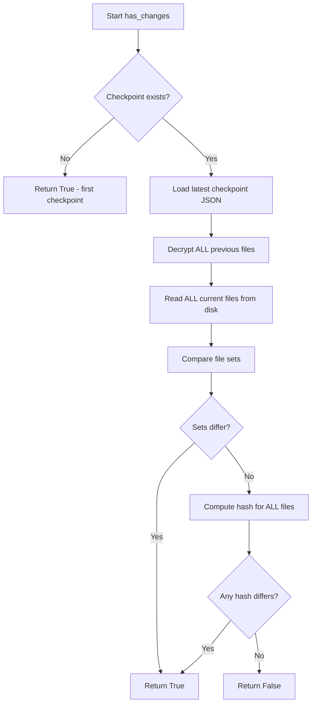
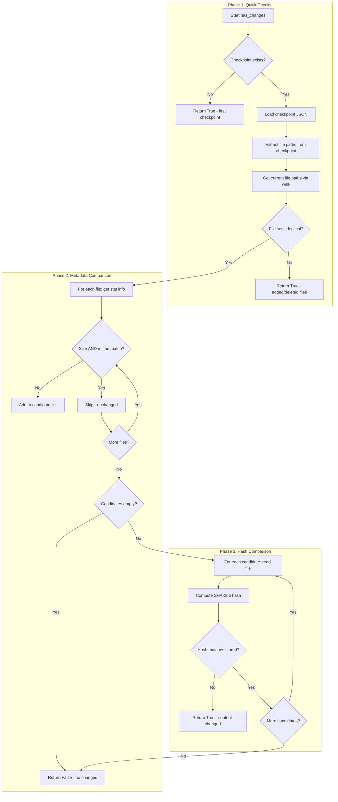
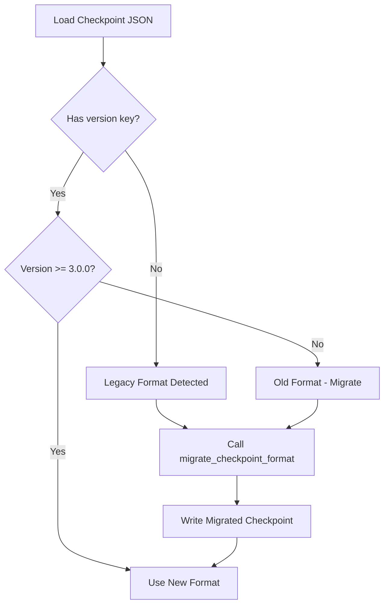

# Optimized Checkpoint Format Design

## Executive Summary

This document describes an optimized checkpoint format that significantly improves change detection performance by:
1. Storing file metadata (size, mtime) for instant stat-based comparison
2. Storing SHA-256 hashes alongside encrypted content to eliminate decryption for comparison
3. Implementing a three-phase change detection algorithm that minimizes I/O operations

---

## Current Implementation Analysis

### Current Checkpoint Format

The current checkpoint stores a simple mapping with no metadata:

```json
{
  "/path/to/file1.py": "encrypted_content_base64...",
  "/path/to/file2.js": "encrypted_content_base64...",
  "/path/to/file3.txt": "encrypted_content_base64..."
}
```

**Location**: [`checkpoint/sequences.py:686-687`](checkpoint/sequences.py:686)

### Current Change Detection Flow

The current [`has_changes()`](checkpoint/trace.py:565) function performs:



**Performance Issues**:
1. **Full Decryption**: Must decrypt every file in the previous checkpoint
2. **Full File Read**: Must read every current file from disk
3. **Full Hash Computation**: Must compute SHA-256 for every file
4. **Double Reading**: Files are read again during checkpoint creation

---

## New Checkpoint Data Structure

### JSON Schema

```json
{
  "$schema": "http://json-schema.org/draft-07/schema#",
  "type": "object",
  "properties": {
    "version": {
      "type": "string",
      "description": "Checkpoint format version",
      "pattern": "^\\d+\\.\\d+\\.\\d+$"
    },
    "created_at": {
      "type": "string",
      "format": "date-time",
      "description": "ISO 8601 timestamp of checkpoint creation"
    },
    "files": {
      "type": "object",
      "additionalProperties": {
        "$ref": "#/definitions/FileEntry"
      }
    }
  },
  "required": ["version", "files"],
  "definitions": {
    "FileEntry": {
      "type": "object",
      "properties": {
        "content": {
          "type": "string",
          "description": "Base64-encoded encrypted content"
        },
        "hash": {
          "type": "string",
          "pattern": "^[a-f0-9]{64}$",
          "description": "SHA-256 hash of original file content"
        },
        "size": {
          "type": "integer",
          "minimum": 0,
          "description": "File size in bytes"
        },
        "mtime": {
          "type": "number",
          "minimum": 0,
          "description": "File modification time as Unix timestamp with microseconds"
        }
      },
      "required": ["content", "hash", "size", "mtime"]
    }
  }
}
```

### Example Checkpoint File

```json
{
  "version": "3.0.0",
  "created_at": "2026-02-25T16:30:00.000Z",
  "files": {
    "/project/src/main.py": {
      "content": "gAAAAABm...",
      "hash": "e3b0c44298fc1c149afbf4c8996fb92427ae41e4649b934ca495991b7852b855",
      "size": 1024,
      "mtime": 1740497400.123456
    },
    "/project/src/utils.py": {
      "content": "gAAAAABn...",
      "hash": "a7ffc6f8bf1ed76651c14756a061d662f580ff4de43b49fa82d80a4b80f8434a",
      "size": 512,
      "mtime": 1740497300.654321
    }
  }
}
```

### Metadata Storage Location

**Decision**: Store metadata in the main checkpoint JSON file alongside encrypted content.

**Rationale**:
- Single file to manage (simpler backup/restore)
- Atomic read operation
- Metadata is not sensitive (no encryption needed for quick access)
- JSON parsing is fast for metadata extraction

**Alternative Considered**: Separate `.metadata` file
- Rejected: Adds complexity, requires two file reads, synchronization issues

---

## Optimized Change Detection Algorithm

### Three-Phase Detection Flow



### Pseudocode

```python
def has_changes_optimized(
    source_dir: str,
    dest_dir: str,
    ignore_dirs: List[str],
    current_files: Optional[Dict[str, bytes]] = None
) -> Tuple[bool, Optional[str], Optional[Dict[str, bytes]]]:
    """
    Optimized change detection using metadata and hash comparison.
    
    Returns
    -------
    Tuple[bool, Optional[str], Optional[Dict[str, bytes]]]
        - bool: True if changes detected
        - Optional[str]: Name of previous checkpoint
        - Optional[Dict[str, bytes]]: Pre-read current files for reuse
    """
    
    # === PHASE 0: Initial Checks ===
    checkpoint_base = os.path.join(dest_dir, '.checkpoint')
    if not os.path.exists(checkpoint_base):
        return True, None, None  # First checkpoint
    
    config_path = os.path.join(checkpoint_base, '.config')
    if not os.path.exists(config_path):
        return True, None, None  # No config
    
    config = json.load(config_path)
    checkpoints = config.get('checkpoints', [])
    if not checkpoints:
        return True, None, None  # No checkpoints
    
    latest_checkpoint = checkpoints[-1]
    checkpoint_path = os.path.join(
        checkpoint_base, latest_checkpoint, f'{latest_checkpoint}.json'
    )
    if not os.path.exists(checkpoint_path):
        return True, latest_checkpoint  # Checkpoint file missing
    
    # Load checkpoint data (NO DECRYPTION NEEDED)
    with open(checkpoint_path, 'r') as f:
        checkpoint_data = json.load(f)
    
    # Handle legacy format (migration path)
    if 'files' not in checkpoint_data:
        # Legacy format: {path: encrypted_content}
        return has_changes_legacy(source_dir, dest_dir, ignore_dirs, current_files)
    
    stored_files = checkpoint_data['files']
    
    # === PHASE 1: File Set Comparison ===
    if current_files is None:
        current_file_paths = get_file_paths(source_dir, ignore_dirs)
    else:
        current_file_paths = set(current_files.keys())
    
    stored_file_paths = set(stored_files.keys())
    
    # Quick check: different number of files
    if len(current_file_paths) != len(stored_file_paths):
        return True, latest_checkpoint, current_files
    
    # Check for added/deleted files
    if current_file_paths != stored_file_paths:
        added = current_file_paths - stored_file_paths
        deleted = stored_file_paths - current_file_paths
        # Changes detected
        return True, latest_checkpoint, current_files
    
    # === PHASE 2: Metadata Comparison ===
    candidates = []  # Files that need hash comparison
    
    for file_path in current_file_paths:
        stored_entry = stored_files[file_path]
        stored_size = stored_entry['size']
        stored_mtime = stored_entry['mtime']
        
        # Get current file metadata via stat (fast)
        try:
            stat_info = os.stat(file_path)
            current_size = stat_info.st_size
            current_mtime = stat_info.st_mtime
        except OSError:
            # File might be inaccessible, treat as changed
            return True, latest_checkpoint, current_files
        
        # Metadata mismatch indicates potential change
        if current_size != stored_size or current_mtime != stored_mtime:
            candidates.append(file_path)
    
    # No candidates means no changes
    if not candidates:
        return False, latest_checkpoint, current_files
    
    # === PHASE 3: Hash Comparison (Candidates Only) ===
    for file_path in candidates:
        stored_hash = stored_files[file_path]['hash']
        
        # Read file content (only for candidates)
        if current_files is not None and file_path in current_files:
            content = current_files[file_path]
        else:
            with open(file_path, 'rb') as f:
                content = f.read()
            # Cache for potential reuse
            if current_files is None:
                current_files = {}
            current_files[file_path] = content
        
        current_hash = compute_file_hash(content)
        
        if current_hash != stored_hash:
            return True, latest_checkpoint, current_files
    
    # All hashes match
    return False, latest_checkpoint, current_files
```

### Performance Comparison

| Scenario | Current Approach | Optimized Approach |
|----------|------------------|-------------------|
| No changes, 1000 files | Decrypt 1000 + Read 1000 + Hash 1000 | Stat 1000 only |
| 1 file changed, 1000 files | Decrypt 1000 + Read 1000 + Hash 1000 | Stat 1000 + Read 1 + Hash 1 |
| New file added | Decrypt 1000 + Read 1001 + Hash 1001 | Path comparison only |
| File deleted | Decrypt 1000 + Read 999 + Hash 999 | Path comparison only |

---

## API Changes

### Modified Functions

#### 1. [`has_changes()`](checkpoint/trace.py:565) in `checkpoint/trace.py`

**Current Signature**:
```python
def has_changes(
    source_dir: str,
    dest_dir: str,
    ignore_dirs: List[str],
    current_files: Optional[Dict[str, bytes]] = None
) -> Tuple[bool, Optional[str]]:
```

**New Signature**:
```python
def has_changes(
    source_dir: str,
    dest_dir: str,
    ignore_dirs: List[str],
    current_files: Optional[Dict[str, bytes]] = None
) -> Tuple[bool, Optional[str], Optional[Dict[str, bytes]]]:
```

**Changes**:
- Return type now includes optional `current_files` dict for reuse
- Implement three-phase detection algorithm
- Add legacy format detection and fallback

#### 2. [`seq_encrypt_files()`](checkpoint/sequences.py:535) in `checkpoint/sequences.py`

**Current Signature**:
```python
def seq_encrypt_files(self, contents) -> dict:
```

**New Signature**:
```python
def seq_encrypt_files(self, contents) -> dict:
```

**Changes**:
- Return value structure changes from `{path: encrypted_content}` to:
  ```python
  {
      path: {
          "content": encrypted_content,
          "hash": sha256_hash,
          "size": file_size,
          "mtime": modification_time
      }
  }
  ```

#### 3. [`seq_create_checkpoint()`](checkpoint/sequences.py:635) in `checkpoint/sequences.py`

**Changes**:
- Update checkpoint JSON structure to include version and files wrapper
- Reuse `current_files` from `has_changes()` to avoid double reading
- Update checkpoint file writing to use new format

### New Functions

#### 1. `get_file_metadata()` in `checkpoint/trace.py`

```python
def get_file_metadata(file_path: str) -> Dict[str, Any]:
    """
    Get file metadata for checkpoint storage.
    
    Parameters
    ----------
    file_path: str
        Path to the file.
    
    Returns
    -------
    Dict[str, Any]
        Dictionary with size and mtime.
    """
    stat_info = os.stat(file_path)
    return {
        'size': stat_info.st_size,
        'mtime': stat_info.st_mtime
    }
```

#### 2. `is_legacy_checkpoint()` in `checkpoint/trace.py`

```python
def is_legacy_checkpoint(checkpoint_data: dict) -> bool:
    """
    Check if checkpoint uses legacy format.
    
    Parameters
    ----------
    checkpoint_data: dict
        Loaded checkpoint JSON data.
    
    Returns
    -------
    bool
        True if legacy format (no 'files' key or 'version' key).
    """
    return 'files' not in checkpoint_data or 'version' not in checkpoint_data
```

#### 3. `migrate_checkpoint_format()` in `checkpoint/sequences.py`

```python
def migrate_checkpoint_format(
    checkpoint_path: str,
    crypt: Crypt
) -> dict:
    """
    Migrate legacy checkpoint to new format.
    
    Parameters
    ----------
    checkpoint_path: str
        Path to the legacy checkpoint JSON file.
    crypt: Crypt
        Crypt instance for decryption.
    
    Returns
    -------
    dict
        Migrated checkpoint data in new format.
    """
    with open(checkpoint_path, 'r') as f:
        legacy_data = json.load(f)
    
    migrated = {
        'version': '3.0.0',
        'created_at': datetime.now(timezone.utc).isoformat(),
        'files': {}
    }
    
    for file_path, encrypted_content in legacy_data.items():
        content = crypt.decrypt(encrypted_content)
        stat_info = os.stat(file_path) if os.path.exists(file_path) else None
        
        migrated['files'][file_path] = {
            'content': encrypted_content,
            'hash': compute_file_hash(content),
            'size': stat_info.st_size if stat_info else 0,
            'mtime': stat_info.st_mtime if stat_info else 0.0
        }
    
    # Write migrated checkpoint
    with open(checkpoint_path, 'w') as f:
        json.dump(migrated, f, indent=4)
    
    return migrated
```

#### 4. `has_changes_legacy()` in `checkpoint/trace.py`

```python
def has_changes_legacy(
    source_dir: str,
    dest_dir: str,
    ignore_dirs: List[str],
    current_files: Optional[Dict[str, bytes]] = None
) -> Tuple[bool, Optional[str], Optional[Dict[str, bytes]]]:
    """
    Legacy change detection for backward compatibility.
    
    Uses the original decryption-based approach for old checkpoints.
    """
    # Original has_changes() logic moved here
    ...
```

---

## Migration Strategy

### Automatic Migration on Read

When loading a checkpoint, detect legacy format and migrate transparently:



### Migration Steps

1. **Detection**: Check for `version` key in checkpoint JSON
2. **Backup**: Create `.backup` of original checkpoint file
3. **Transform**: Decrypt content, compute hashes, get metadata
4. **Write**: Save in new format
5. **Cleanup**: Remove backup after successful migration

### Backward Compatibility

| Checkpoint Version | Read Support | Write Support |
|-------------------|--------------|---------------|
| Pre-3.0.0 (legacy) | Yes (with migration) | No |
| 3.0.0 | Yes | Yes |

### Migration Command (Optional)

Add CLI command for explicit migration:

```bash
python -m checkpoint --migrate-checkpoints
```

This would migrate all checkpoints in the `.checkpoint` directory to the new format.

---

## Implementation Checklist

### Phase 1: Data Structure Changes
- [ ] Update `seq_encrypt_files()` to return new format
- [ ] Update `seq_create_checkpoint()` to write new format
- [ ] Add version and created_at fields to checkpoint JSON

### Phase 2: Change Detection Optimization
- [ ] Implement `get_file_metadata()` function
- [ ] Implement `is_legacy_checkpoint()` function
- [ ] Implement `has_changes_legacy()` function (move existing logic)
- [ ] Implement new `has_changes()` with three-phase algorithm
- [ ] Update return type to include cached current_files

### Phase 3: Migration Support
- [ ] Implement `migrate_checkpoint_format()` function
- [ ] Add automatic migration on checkpoint load
- [ ] Add backup creation before migration
- [ ] Test migration with existing checkpoints

### Phase 4: Integration
- [ ] Update `seq_create_checkpoint()` to reuse current_files
- [ ] Update `seq_restore_checkpoint()` to handle new format
- [ ] Update trace generation to use new format
- [ ] Add CLI migration command (optional)

### Phase 5: Testing
- [ ] Unit tests for new checkpoint format
- [ ] Unit tests for three-phase change detection
- [ ] Integration tests for migration
- [ ] Performance benchmarks comparing old vs new

---

## Risk Assessment

### Low Risk
- **Metadata storage**: Size and mtime are non-sensitive, no encryption needed
- **Hash storage**: SHA-256 hashes cannot be reversed to content

### Medium Risk
- **mtime precision**: Some filesystems have low mtime precision (1-2 seconds)
  - **Mitigation**: Use hash comparison as fallback when mtime matches but size differs
- **Clock skew**: System clock changes could affect mtime comparisons
  - **Mitigation**: Hash comparison catches false positives

### Mitigated Risks
- **Legacy compatibility**: Automatic migration with backup ensures no data loss
- **Performance regression**: Legacy fallback ensures old checkpoints still work

---

## Appendix: File Structure After Changes

```
destination_dir/
└── .checkpoint/
    ├── .config              # JSON: checkpoint list, settings
    ├── crypt.key            # Encryption key
    ├── checkpoint_name_1/
    │   ├── checkpoint_name_1.json  # NEW FORMAT with metadata
    │   ├── .metadata               # File listing (unchanged)
    │   └── trace.json              # Change trace (unchanged)
    └── checkpoint_name_2/
        └── ...
```

### New Checkpoint JSON Structure

```json
{
  "version": "3.0.0",
  "created_at": "2026-02-25T16:30:00.000Z",
  "files": {
    "/absolute/path/to/file.py": {
      "content": "gAAAAABm...",
      "hash": "e3b0c44298fc1c149afbf4c8996fb92427ae41e4649b934ca495991b7852b855",
      "size": 1024,
      "mtime": 1740497400.123456
    }
  }
}
```
