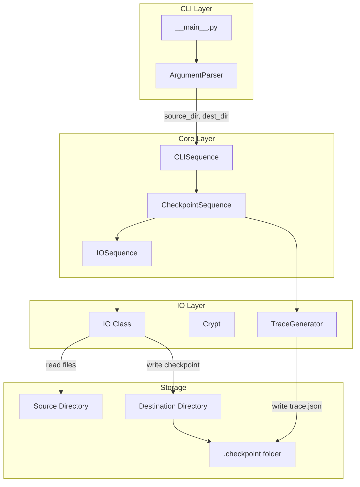

# Design Document: Source/Destination Path Separation

## Overview

This document outlines the implementation plan for separating the source and destination paths in the checkpoint system. Currently, both concepts are conflated into `root_dir`, where the `.checkpoint` folder is always created inside the tracked directory. This design enables storing checkpoint data in a separate location from the tracked files.

## Current Architecture Analysis

### Current Behavior
```
source_dir/
├── .checkpoint/           # Always inside source
│   ├── .config
│   ├── .metadata
│   ├── crypt.key
│   └── checkpoint_name/
│       ├── checkpoint_name.json
│       └── trace.json
├── file1.py
└── file2.py
```

### Proposed Behavior
```
source_dir/               # Tracked files only
├── file1.py
└── file2.py

destination_dir/          # Checkpoint storage
└── .checkpoint/
    ├── .config
    ├── .metadata
    ├── crypt.key
    └── checkpoint_name/
        ├── checkpoint_name.json
        └── trace.json
```

## Key Files Requiring Modification

| File | Purpose | Changes Required |
|------|---------|------------------|
| [`checkpoint/__main__.py`](checkpoint/__main__.py) | CLI argument parsing | Add `--source` and `--destination` arguments |
| [`checkpoint/sequences.py`](checkpoint/sequences.py) | Core checkpoint logic | Modify `IOSequence` and `CheckpointSequence` classes |
| [`checkpoint/trace.py`](checkpoint/trace.py) | Trace generation | Update `TraceGenerator` class |
| [`checkpoint/ui/main.py`](checkpoint/ui/main.py) | UI backend | Update UI functions to handle separate paths |
| [`checkpoint/io.py`](checkpoint/io.py) | IO operations | Minor updates for path handling |

---

## 1. CLI Changes (`__main__.py`)

### Current Implementation
```python
checkpoint_arg_parser.add_argument(
    "-p",
    "--path",
    type=str,
    help="Path to the project.",
)
```

### Proposed Changes

#### New Argument Structure
```python
checkpoint_arg_parser.add_argument(
    "-s",
    "--source",
    type=str,
    help="Source directory to track/monitor for changes.",
)

checkpoint_arg_parser.add_argument(
    "-d",
    "--destination",
    type=str,
    help="Destination directory where .checkpoint folder will be created. "
         "Defaults to source directory if not provided.",
)

# Keep --path for backward compatibility (deprecated)
checkpoint_arg_parser.add_argument(
    "-p",
    "--path",
    type=str,
    help="[DEPRECATED] Use --source instead. Path to the project.",
)
```

#### Argument Resolution Logic
```python
def resolve_paths(args):
    """Resolve source and destination paths from arguments.
    
    Priority:
    1. If --source and --destination provided: use both
    2. If only --source provided: destination = source
    3. If only --path provided: source = destination = path (backward compat)
    4. If neither provided: source = destination = os.getcwd()
    """
    if args.source:
        source_dir = os.path.abspath(args.source)
        dest_dir = os.path.abspath(args.destination) if args.destination else source_dir
    elif args.path:
        source_dir = os.path.abspath(args.path)
        dest_dir = source_dir
    else:
        source_dir = os.getcwd()
        dest_dir = source_dir
    
    return source_dir, dest_dir
```

---

## 2. Core Logic Changes (`sequences.py`)

### 2.1 IOSequence Class

#### Current Constructor
```python
def __init__(self, sequence_name='IO_Sequence', order_dict=None,
             root_dir=None, ignore_dirs=None, num_cores=None,
             terminal_log=False, env='UI'):
    self.root_dir = root_dir or os.getcwd()
    self.ignore_dirs = ignore_dirs or []
    self.ignore_dirs.append('.checkpoint')
    self.io = IO(self.root_dir, ignore_dirs=self.ignore_dirs)
```

#### Proposed Constructor
```python
def __init__(self, sequence_name='IO_Sequence', order_dict=None,
             source_dir=None, dest_dir=None, ignore_dirs=None, num_cores=None,
             terminal_log=False, env='UI'):
    """Initialize the IO sequence class.

    Parameters
    ----------
    source_dir: str, optional
        The source directory to track/monitor.
    dest_dir: str, optional
        The destination directory for .checkpoint storage.
        Defaults to source_dir if not provided.
    """
    self.source_dir = source_dir or os.getcwd()
    self.dest_dir = dest_dir or self.source_dir
    
    self.ignore_dirs = ignore_dirs or []
    # Only add .checkpoint to ignore if source == destination
    if self.source_dir == self.dest_dir:
        self.ignore_dirs.append('.checkpoint')
    
    # IO for reading source files
    self.io = IO(self.source_dir, ignore_dirs=self.ignore_dirs)
```

#### Methods Requiring Updates

| Method | Current Usage | Proposed Change |
|--------|---------------|-----------------|
| `seq_walk_directories()` | Uses `self.io.walk_directory()` | No change - walks source |
| `seq_encrypt_files()` | Uses `os.path.join(self.root_dir, '.checkpoint')` | Use `os.path.join(self.dest_dir, '.checkpoint')` |

### 2.2 CheckpointSequence Class

#### Current Constructor
```python
def __init__(self, sequence_name, order_dict, root_dir, ignore_dirs,
             terminal_log=False, env='UI', checkpoint_type=None):
    self.root_dir = root_dir
    self.ignore_dirs = ignore_dirs
```

#### Proposed Constructor
```python
def __init__(self, sequence_name, order_dict, source_dir, dest_dir, ignore_dirs,
             terminal_log=False, env='UI', checkpoint_type=None):
    """Initialize the CheckpointSequence class.

    Parameters
    ----------
    source_dir: str
        The source directory to track/monitor.
    dest_dir: str
        The destination directory for .checkpoint storage.
    """
    self.sequence_name = sequence_name
    self.order_dict = order_dict
    self.source_dir = source_dir
    self.dest_dir = dest_dir
    self.ignore_dirs = ignore_dirs
    self.checkpoint_type = checkpoint_type
```

#### Method-Specific Changes

##### `seq_init_checkpoint()`
```python
def seq_init_checkpoint(self):
    """Initialize the checkpoint directory."""
    # Create .checkpoint in destination
    _io = IO(path=self.dest_dir, mode="a", ignore_dirs=self.ignore_dirs)
    path = _io.make_dir('.checkpoint')
    generate_key('crypt.key', path)

    checkpoint_config = {
        'current_checkpoint': None,
        'checkpoints': [],
        'ignore_dirs': self.ignore_dirs,
        'source_dir': self.source_dir,  # NEW: Store source path
        'dest_dir': self.dest_dir,       # NEW: Store destination path
    }

    config_path = os.path.join(self.dest_dir, '.checkpoint', '.config')
    _io.write(config_path, 'w+', json.dumps(checkpoint_config))
```

##### `seq_create_checkpoint()`
```python
def seq_create_checkpoint(self):
    """Create a new checkpoint for the target directory."""
    # Check if checkpoint exists in destination
    checkpoint_path = os.path.join(self.dest_dir, '.checkpoint', self.sequence_name)
    if os.path.isdir(checkpoint_path):
        raise ValueError(f'Checkpoint {self.sequence_name} already exists')

    # IO for destination (write checkpoint data)
    _io = IO(path=self.dest_dir, mode="a", ignore_dirs=self.ignore_dirs)

    # IOSequence reads from source, encrypts, and we store in destination
    _io_sequence = IOSequence(
        source_dir=self.source_dir,
        dest_dir=self.dest_dir,
        ignore_dirs=self.ignore_dirs,
        terminal_log=self.terminal_log, 
        env=self.env
    )

    enc_files = _io_sequence.execute_sequence(pass_args=True)[-1]

    # Create checkpoint directory in destination
    checkpoint_path = os.path.join(self.dest_dir, '.checkpoint', self.sequence_name)
    checkpoint_path = _io.make_dir(checkpoint_path)
    
    # ... rest of method uses self.dest_dir for paths
```

##### `seq_restore_checkpoint()`
```python
def seq_restore_checkpoint(self):
    """Restore back to a specific checkpoint."""
    self._validate_checkpoint()
    
    # IO for writing to source directory
    _io = IO(path=self.source_dir, mode="a", ignore_dirs=self.ignore_dirs)
    
    # Read encryption key from destination
    _key = os.path.join(self.dest_dir, '.checkpoint')
    crypt = Crypt(key='crypt.key', key_path=_key)

    # Read checkpoint data from destination
    checkpoint_path = os.path.join(self.dest_dir, '.checkpoint',
                                   self.sequence_name, f'{self.sequence_name}.json')
    
    # ... restore files to source_dir
```

##### `_validate_checkpoint()`
```python
def _validate_checkpoint(self):
    """Validate if a checkpoint is valid."""
    checkpoint_path = os.path.join(self.dest_dir, '.checkpoint', self.sequence_name)
    if not os.path.isdir(checkpoint_path):
        raise ValueError(f'Checkpoint {self.sequence_name} does not exist')
```

##### `_generate_trace()`
```python
def _generate_trace(self, enc_files, checkpoint_path):
    """Generate trace.json for the checkpoint."""
    # Read key from destination
    _key = os.path.join(self.dest_dir, '.checkpoint')
    crypt = Crypt(key='crypt.key', key_path=_key)
    
    # ... decryption logic ...
    
    # Read config from destination
    config_path = os.path.join(self.dest_dir, '.checkpoint', '.config')
    
    # ... rest of method ...
    
    trace_generator = TraceGenerator(
        checkpoint_name=self.sequence_name,
        checkpoint_type=self.checkpoint_type,
        source_dir=self.source_dir,
        dest_dir=self.dest_dir
    )
```

### 2.3 CLISequence Class

#### Updated `seq_perform_action()`
```python
def seq_perform_action(self, action_args):
    """Perform the action."""
    action, args = action_args
    _name = args.name
    _source, _dest = resolve_paths(args)  # NEW: Use path resolution
    _ignore_dirs = args.ignore_dirs or []
    _checkpoint_type = getattr(args, 'type', None)
    _helper_actions = ['seq_init_checkpoint', 'seq_version']

    if not (_name and _source) and action not in _helper_actions:
        raise ValueError(f'{args.action} requires a valid name and a source path')

    order_dict = {action: 0}
    _checkpoint_sequence = CheckpointSequence(
        _name, order_dict, _source, _dest, _ignore_dirs,  # Updated signature
        terminal_log=self.terminal_log, env=self.env,
        checkpoint_type=_checkpoint_type
    )
    action_function = getattr(_checkpoint_sequence, action)
    action_function()
```

---

## 3. Trace Generator Changes (`trace.py`)

### Current Constructor
```python
def __init__(self, checkpoint_name: str, checkpoint_type: str, root_dir: str):
    self.checkpoint_name = checkpoint_name
    self.checkpoint_type = checkpoint_type
    self.root_dir = root_dir
```

### Proposed Constructor
```python
def __init__(self, checkpoint_name: str, checkpoint_type: str, 
             source_dir: str, dest_dir: str = None):
    """Initialize the TraceGenerator.

    Parameters
    ----------
    checkpoint_name: str
        Name of the current checkpoint.
    checkpoint_type: str
        Type of checkpoint ('human' or 'ai').
    source_dir: str
        Source directory of the project (for reference).
    dest_dir: str, optional
        Destination directory for checkpoint storage.
        Defaults to source_dir if not provided.
    """
    self.checkpoint_name = checkpoint_name
    self.checkpoint_type = checkpoint_type
    self.source_dir = source_dir
    self.dest_dir = dest_dir or source_dir
```

### Method Updates

#### `get_previous_checkpoint_name()`
```python
def get_previous_checkpoint_name(self) -> Optional[str]:
    """Get the name of the previous checkpoint."""
    # Read config from destination
    config_path = os.path.join(self.dest_dir, '.checkpoint', '.config')
    if not os.path.exists(config_path):
        return None
    # ... rest unchanged
```

#### `generate_and_save()`
```python
def generate_and_save(self, current_files: Dict[str, bytes], ...) -> str:
    """Generate trace.json and save it to the checkpoint directory."""
    trace_data = generate_trace(...)

    # Save to destination
    checkpoint_dir = os.path.join(self.dest_dir, '.checkpoint', self.checkpoint_name)
    return save_trace(trace_data, checkpoint_dir)
```

---

## 4. UI Changes (`ui/main.py`)

### Functions Requiring Updates

#### `run_cli_sequence()`
```python
@eel.expose
def run_cli_sequence(args=None):
    # Parse args including new --source and --destination
    checkpoint_arg_parser.add_argument(
        "-s", "--source",
        type=str,
        help="Source directory to track.",
    )
    
    checkpoint_arg_parser.add_argument(
        "-d", "--destination", 
        type=str,
        help="Destination directory for .checkpoint storage.",
    )
    # ... rest of function
```

#### `get_all_checkpoints()`
```python
@eel.expose
def get_all_checkpoints(target_dir):
    """Get all checkpoints from the target directory.
    
    Note: target_dir is treated as the destination directory.
    """
    checkpoint_path = os.path.join(target_dir, '.checkpoint')
    # ... rest unchanged
```

#### `get_ignore_dirs()`
```python
@eel.expose
def get_ignore_dirs(target_dir):
    """Get ignore dirs from checkpoint config."""
    # target_dir is the destination directory
    checkpoint_path = os.path.join(target_dir, '.checkpoint')
    # ... rest unchanged
```

#### `get_current_checkpoint()`
```python
@eel.expose
def get_current_checkpoint(target_dir):
    """Get current checkpoint from destination directory."""
    checkpoint_path = os.path.join(target_dir, '.checkpoint')
    # ... rest unchanged
```

#### `generate_tree()`
```python
@eel.expose
def generate_tree(checkpoint_name, target_directory):
    """Generate a Tree from the metadata of a certain checkpoint.
    
    Parameters
    ----------
    checkpoint_name: str
        Name of the checkpoint.
    target_directory: str
        Path to the destination directory (where .checkpoint exists).
    """
    # ... uses target_directory to read .checkpoint/.metadata
```

### New UI Functions Needed

```python
@eel.expose
def get_source_dir(dest_dir):
    """Get the source directory from checkpoint config.
    
    Parameters
    ----------
    dest_dir: str
        The destination directory containing .checkpoint.
    
    Returns
    -------
    str
        The source directory path stored in config.
    """
    config_path = os.path.join(dest_dir, '.checkpoint', '.config')
    if not os.path.isfile(config_path):
        return None
    
    with open(config_path, 'r') as f:
        config = json.load(f)
        return config.get('source_dir')
```

---

## 5. Configuration File Changes

### Current `.config` Format
```json
{
    "current_checkpoint": "checkpoint_name",
    "checkpoints": ["checkpoint1", "checkpoint2"],
    "ignore_dirs": [".git", "node_modules"],
    "root_dir": "/path/to/project"
}
```

### Proposed `.config` Format
```json
{
    "current_checkpoint": "checkpoint_name",
    "checkpoints": ["checkpoint1", "checkpoint2"],
    "ignore_dirs": [".git", "node_modules"],
    "source_dir": "/path/to/source",
    "dest_dir": "/path/to/destination",
    "version": "2.0.0"
}
```

### Migration Strategy
- Add `version` field for future compatibility
- Keep `root_dir` during migration for backward compatibility
- On first run with new version, migrate old config format

---

## 6. Edge Cases and Error Handling

### Case 1: Source and Destination are the Same
```python
if os.path.abspath(source_dir) == os.path.abspath(dest_dir):
    # Backward compatible behavior
    # Add .checkpoint to ignore_dirs
    ignore_dirs.append('.checkpoint')
```

### Case 2: Destination Directory Does Not Exist
```python
def ensure_destination_exists(dest_dir):
    """Ensure destination directory exists, create if needed."""
    if not os.path.exists(dest_dir):
        os.makedirs(dest_dir)
        logger.log(f"Created destination directory: {dest_dir}")
```

### Case 3: Relative vs Absolute Paths
```python
def normalize_path(path):
    """Normalize a path to absolute form.
    
    - Expands user home directory (~)
    - Converts relative to absolute
    - Resolves symlinks
    """
    return os.path.abspath(os.path.expanduser(path))
```

### Case 4: Source Directory Does Not Exist
```python
def validate_source_dir(source_dir):
    """Validate that source directory exists and is accessible."""
    if not os.path.exists(source_dir):
        raise ValueError(f"Source directory does not exist: {source_dir}")
    if not os.path.isdir(source_dir):
        raise ValueError(f"Source path is not a directory: {source_dir}")
    if not os.access(source_dir, os.R_OK):
        raise PermissionError(f"Cannot read from source directory: {source_dir}")
```

### Case 5: Cross-Platform Path Handling
```python
# Always use os.path.join for path construction
# Store paths in config using forward slashes for portability
def store_path(path):
    """Store path in normalized format."""
    return path.replace('\\', '/')

def load_path(path):
    """Load path, converting to OS-specific format."""
    return os.path.normpath(path)
```

### Case 6: Checkpoint Restoration with Changed Source
```python
def validate_source_for_restore(config_source_dir, current_source_dir):
    """Validate source directory matches config during restore."""
    if os.path.abspath(config_source_dir) != os.path.abspath(current_source_dir):
        logger.log(
            "Warning: Restoring to different source directory than original",
            LogColors.WARNING
        )
        # Allow restore but warn user
```

---

## 7. Migration Considerations

### Automatic Migration on Init
```python
def migrate_config_if_needed(config_path):
    """Migrate old config format to new format."""
    with open(config_path, 'r') as f:
        config = json.load(f)
    
    # Check if migration needed
    if 'root_dir' in config and 'source_dir' not in config:
        config['source_dir'] = config['root_dir']
        config['dest_dir'] = config['root_dir']
        config['version'] = '2.0.0'
        
        with open(config_path, 'w') as f:
            json.dump(config, f, indent=4)
        
        logger.log("Migrated config to new format", LogColors.INFO)
    
    return config
```

### Backward Compatibility Layer
```python
def load_config(config_path):
    """Load config with backward compatibility."""
    config = json.load(config_path)
    
    # Handle old format
    if 'root_dir' in config:
        config.setdefault('source_dir', config['root_dir'])
        config.setdefault('dest_dir', config['root_dir'])
    
    return config
```

---

## 8. Architecture Diagram



---

## 9. Implementation Checklist

### Phase 1: Core Changes
- [ ] Update `IOSequence.__init__()` to accept `source_dir` and `dest_dir`
- [ ] Update `CheckpointSequence.__init__()` to accept `source_dir` and `dest_dir`
- [ ] Update all methods in `CheckpointSequence` to use correct paths
- [ ] Update `TraceGenerator` to use `dest_dir` for config/trace paths

### Phase 2: CLI Changes
- [ ] Add `--source` and `--destination` arguments to `__main__.py`
- [ ] Implement `resolve_paths()` function
- [ ] Update `CLISequence.seq_perform_action()` to use new arguments
- [ ] Add deprecation warning for `--path` argument

### Phase 3: UI Changes
- [ ] Update `run_cli_sequence()` in `ui/main.py`
- [ ] Add `get_source_dir()` function for UI
- [ ] Update frontend components if needed

### Phase 4: Configuration & Migration
- [ ] Update `.config` format with `source_dir` and `dest_dir`
- [ ] Implement config migration logic
- [ ] Add backward compatibility layer

### Phase 5: Testing
- [ ] Add unit tests for path resolution
- [ ] Add tests for separate source/destination
- [ ] Add tests for backward compatibility
- [ ] Add tests for edge cases

---

## 10. API Summary

### New Function Signatures

```python
# IOSequence
def __init__(self, sequence_name='IO_Sequence', order_dict=None,
             source_dir=None, dest_dir=None, ignore_dirs=None, 
             num_cores=None, terminal_log=False, env='UI')

# CheckpointSequence  
def __init__(self, sequence_name, order_dict, source_dir, dest_dir, 
             ignore_dirs, terminal_log=False, env='UI', checkpoint_type=None)

# TraceGenerator
def __init__(self, checkpoint_name: str, checkpoint_type: str,
             source_dir: str, dest_dir: str = None)

# CLISequence (internal helper)
def resolve_paths(args: Namespace) -> Tuple[str, str]
```

### CLI Usage Examples

```bash
# Backward compatible (source = destination)
checkpoint -a create -n my_checkpoint -p /path/to/project

# New usage with separate paths
checkpoint -a create -n my_checkpoint --source /path/to/source --destination /path/to/dest

# Only source provided (destination = source)
checkpoint -a create -n my_checkpoint --source /path/to/project

# Restore to different location
checkpoint -a restore -n my_checkpoint --source /path/to/restore/to --destination /path/to/checkpoint/storage
```

---

## 11. Summary

This design separates the concepts of:
- **Source path**: The directory being tracked/monitored for file changes
- **Destination path**: Where the `.checkpoint` folder and all checkpoint data is stored

Key benefits:
1. **Flexibility**: Checkpoint data can be stored on different drives or locations
2. **Clean source directories**: Source projects remain uncluttered by checkpoint data
3. **Centralized checkpoint storage**: Multiple projects can share a checkpoint storage location
4. **Backward compatibility**: Existing workflows continue to work unchanged
