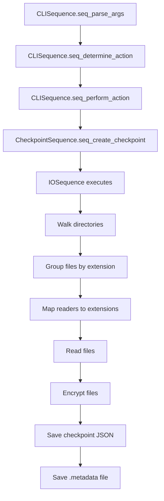
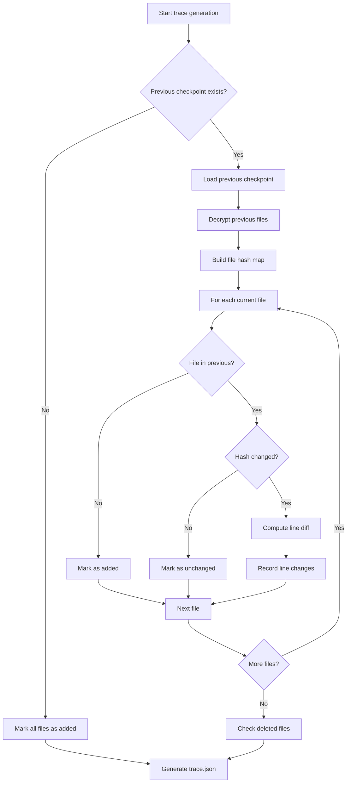
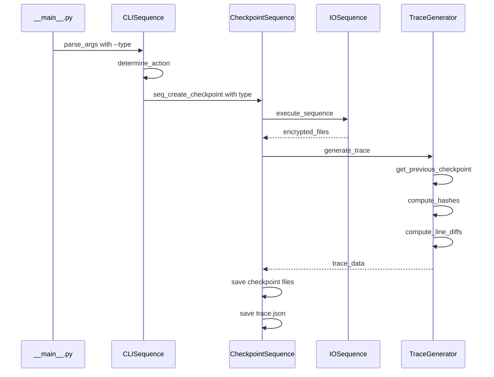

# Trace.json Feature Design Document

## Executive Summary

This document outlines the design for adding a `--type` parameter to the checkpoint `create` action and implementing a `trace.json` file that tracks content changes between checkpoint versions.

---

## 1. Current Architecture Analysis

### 1.1 CLI Argument Parsing

The CLI is defined in [`checkpoint/__main__.py`](checkpoint/__main__.py:14) using Python's `argparse.ArgumentParser`. Current arguments include:

| Argument | Short | Description |
|----------|-------|-------------|
| `--run-ui` | | Start UI environment |
| `--name` | `-n` | Name of the restore point |
| `--path` | `-p` | Path to the project |
| `--action` | `-a` | Action: create, restore, version, delete, init |
| `--ignore-dirs` | `-i` | Directories to ignore |

### 1.2 Checkpoint Creation Flow



### 1.3 Checkpoint File Structure

When a checkpoint is created, the following structure is generated:

```
.checkpoint/
├── .config           # Global config with checkpoint list
├── crypt.key         # Encryption key
└── <checkpoint_name>/
    ├── <checkpoint_name>.json   # Encrypted file contents
    └── .metadata                # Directory to file paths mapping
```

### 1.4 Metadata File Format

The [`.metadata`](.checkpoint/before-changes/.metadata:1) file is a JSON structure mapping directories to file paths:

```json
{
    ".": ["./file1.txt", "./file2.py"],
    "./checkpoint": ["./checkpoint/__main__.py", ...]
}
```

---

## 2. Proposed trace.json Schema

### 2.1 Schema Definition

```json
{
    "checkpoint_name": "string",
    "checkpoint_type": "human|ai",
    "created_at": "ISO8601 timestamp",
    "previous_checkpoint": "string|null",
    "files": {
        "<file_path>": {
            "status": "added|modified|deleted|unchanged",
            "hash": "SHA-256 content hash",
            "line_changes": [
                {
                    "start_line": 12,
                    "end_line": 16,
                    "change_type": "added|modified|deleted"
                }
            ],
            "stats": {
                "lines_added": 5,
                "lines_deleted": 2,
                "lines_modified": 3
            }
        }
    },
    "summary": {
        "total_files_changed": 10,
        "total_lines_added": 150,
        "total_lines_deleted": 45,
        "new_files": 3,
        "deleted_files": 1
    }
}
```

### 2.2 Field Descriptions

| Field | Type | Description |
|-------|------|-------------|
| `checkpoint_name` | string | Name of the current checkpoint |
| `checkpoint_type` | enum | Either `human` or `ai` indicating the source |
| `created_at` | string | ISO 8601 timestamp of checkpoint creation |
| `previous_checkpoint` | string|null | Name of the previous checkpoint for comparison |
| `files` | object | Map of file paths to their change information |
| `files.<path>.status` | enum | File status: added, modified, deleted, unchanged |
| `files.<path>.hash` | string | SHA-256 hash of current file content |
| `files.<path>.line_changes` | array | List of line range changes |
| `files.<path>.stats` | object | Line-level statistics for the file |
| `summary` | object | Aggregate statistics across all files |

---

## 3. Algorithm Design

### 3.1 Content Hash Computation

Use SHA-256 for content hashing:

```python
import hashlib

def compute_file_hash(content: bytes) -> str:
    """Compute SHA-256 hash of file content."""
    return hashlib.sha256(content).hexdigest()
```

### 3.2 Line-Level Diff Algorithm

Use Python's `difflib` module for computing line-level differences:

```python
import difflib

def compute_line_changes(old_lines: list[str], new_lines: list[str]) -> list[dict]:
    """
    Compute line-level changes between two file versions.
    
    Returns a list of change ranges with start/end lines and change type.
    """
    changes = []
    matcher = difflib.SequenceMatcher(None, old_lines, new_lines)
    
    for tag, i1, i2, j1, j2 in matcher.get_opcodes():
        if tag == 'equal':
            continue
        
        change = {
            'start_line': j1 + 1,  # 1-indexed
            'end_line': j2,
            'change_type': tag,  # 'replace', 'delete', 'insert'
            'old_range': [i1 + 1, i2] if tag in ('replace', 'delete') else None
        }
        changes.append(change)
    
    return changes
```

### 3.3 Change Detection Flow



---

## 4. Implementation Plan

### 4.1 Files to Modify

| File | Changes Required |
|------|------------------|
| [`checkpoint/__main__.py`](checkpoint/__main__.py:49) | Add `--type` argument to ArgumentParser |
| [`checkpoint/sequences.py`](checkpoint/sequences.py:521) | Modify `seq_create_checkpoint` to generate trace.json |
| [`checkpoint/constants.py`](checkpoint/constants.py:1) | Add trace-related constants |

### 4.2 New Files to Create

| File | Purpose |
|------|---------|
| `checkpoint/trace.py` | Trace generation logic including hash computation and diff algorithms |

### 4.3 Detailed Implementation Steps

#### Step 1: Add `--type` CLI Argument

In [`checkpoint/__main__.py`](checkpoint/__main__.py:49), add after the `--ignore-dirs` argument:

```python
checkpoint_arg_parser.add_argument(
    "--type",
    "-t",
    type=str,
    help="Type of checkpoint: human or ai",
    choices=["human", "ai"],
    default=None
)
```

#### Step 2: Create `checkpoint/trace.py` Module

Create a new module with the following classes and functions:

```python
# checkpoint/trace.py

import hashlib
import json
from datetime import datetime
from typing import Optional
import difflib

class TraceGenerator:
    """Generates trace.json for checkpoint comparisons."""
    
    def __init__(self, checkpoint_name: str, checkpoint_type: str, root_dir: str):
        self.checkpoint_name = checkpoint_name
        self.checkpoint_type = checkpoint_type
        self.root_dir = root_dir
    
    def compute_hash(self, content: bytes) -> str:
        """Compute SHA-256 hash of content."""
        pass
    
    def compute_line_diff(self, old_content: str, new_content: str) -> dict:
        """Compute line-level differences between two file versions."""
        pass
    
    def get_previous_checkpoint(self) -> Optional[str]:
        """Get the name of the previous checkpoint."""
        pass
    
    def generate_trace(self, current_files: dict, previous_files: Optional[dict] = None) -> dict:
        """Generate the complete trace.json structure."""
        pass
    
    def save_trace(self, trace: dict, checkpoint_path: str) -> None:
        """Save trace.json to the checkpoint directory."""
        pass
```

#### Step 3: Modify `CheckpointSequence.seq_create_checkpoint`

In [`checkpoint/sequences.py`](checkpoint/sequences.py:521), modify the checkpoint creation to:

1. Accept the `checkpoint_type` parameter
2. Generate trace.json when type is specified
3. Compare with previous checkpoint if available

#### Step 4: Update `CLISequence.seq_perform_action`

Pass the `type` argument from parsed args to the CheckpointSequence.

### 4.4 Integration Points



---

## 5. Edge Cases and Considerations

### 5.1 First Checkpoint

When creating the first checkpoint:
- No previous checkpoint exists for comparison
- All files should be marked as `added`
- `previous_checkpoint` should be `null`

### 5.2 Binary Files

For binary files:
- Line-level diff is not meaningful
- Only track hash changes
- Set `line_changes` to empty array
- Include a `is_binary: true` flag

### 5.3 Deleted Files

When a file exists in previous checkpoint but not in current:
- Mark status as `deleted`
- Include the hash from the previous version
- `line_changes` should reflect full file deletion

### 5.4 Large Files

For performance with large files:
- Consider streaming hash computation
- Limit line diff to files under a size threshold
- Add configuration option for max diff size

### 5.5 Encoding Handling

Handle different file encodings:
- Use the same encoding handling as `TextReader`
- Fall back to binary comparison for encoding errors

---

## 6. Testing Strategy

### 6.1 Unit Tests

Create `checkpoint/tests/test_trace.py` with tests for:

- `test_compute_hash`: Verify SHA-256 hash computation
- `test_compute_line_diff_added`: Test added lines detection
- `test_compute_line_diff_deleted`: Test deleted lines detection
- `test_compute_line_diff_modified`: Test modified lines detection
- `test_generate_trace_first_checkpoint`: Test first checkpoint scenario
- `test_generate_trace_subsequent`: Test comparison with previous
- `test_binary_file_handling`: Test binary file edge case

### 6.2 Integration Tests

- Test CLI with `--type human` argument
- Test CLI with `--type ai` argument
- Test trace.json generation in checkpoint directory
- Test trace.json content accuracy

---

## 7. Dependencies

No new external dependencies required. The implementation uses:
- `hashlib` (standard library) for SHA-256 hashing
- `difflib` (standard library) for line-level diffs
- `json` (standard library) for trace.json output
- `datetime` (standard library) for timestamps

---

## 8. Summary

This design introduces:

1. **New CLI argument**: `--type` with choices `human` or `ai`
2. **New file**: `checkpoint/trace.py` for trace generation logic
3. **New output**: `trace.json` in each checkpoint directory when type is specified
4. **Modified files**: `__main__.py`, `sequences.py`, `constants.py`

The trace.json provides:
- File-level change tracking (added, modified, deleted, unchanged)
- Line-level change ranges for text files
- Content hashes for integrity verification
- Summary statistics for quick overview
